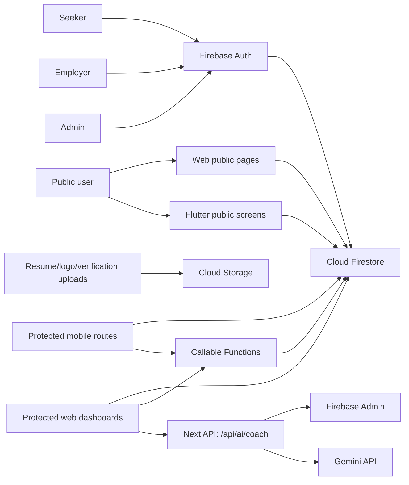

# THENIJOBS End-to-End Audit Report

Date: 2026-06-09  
Workspace: `E:/thenijobs-main`  
Audit rule followed: no application code was modified. This report is documentation only.

## Scope And Limits

This audit covered the top-level Next.js app, the nested `thenijobs-main` Next.js/Firebase Functions app, the `thenijobs-flutter` mobile app, Firestore and Storage rules, Firebase hosting/function configuration, indexes, package dependencies, build outputs, source workflows, and a browser smoke check of the nested web homepage.

Limits:

- No production Firebase credentials or seeded test accounts were available, so authenticated manual E2E testing was limited to source-path verification and build/runtime inspection.
- `flutter` and `dart` were not installed on PATH, so the Flutter app could not be rebuilt or tested from this environment.
- The repo contains two web app trees with overlapping files. The nested `thenijobs-main` tree is more deployment-ready; the top-level tree is still configured as a static export and has more warnings.
- Existing untracked audit documents were present before this report. Findings below were verified against current source/build output rather than accepting those documents as truth.

Screenshot captured:

## Verification Matrix

| Area | Command / Check | Result |
|---|---:|---|
| Top-level web lint | `npm.cmd run lint` | Pass with 139 warnings |
| Top-level web typecheck | `npx.cmd tsc --noEmit` | Pass |
| Top-level web build | `npm.cmd run build` | Pass, 71 static pages |
| Top-level web audit | `npm.cmd audit --omit=dev --audit-level=low` | 2 moderate advisories |
| Nested web lint | `npm.cmd run lint` in `thenijobs-main` | Pass |
| Nested web typecheck | `npm.cmd run typecheck` | Pass |
| Nested web build | `npm.cmd run build` | Pass, about 5.5 minutes |
| Nested web audit | `npm.cmd audit --omit=dev --audit-level=low` | 0 vulnerabilities |
| Firebase Functions build | `npm.cmd run build` in `thenijobs-main/functions` | Pass |
| Firebase Functions audit | `npm.cmd audit --omit=dev --audit-level=low` | 8 moderate advisories |
| Flutter toolchain | `flutter --version`, `dart --version` | Not available |
| Existing APKs | `thenijobs-flutter/build/app/outputs/flutter-apk` | Debug APKs exist, about 166 MB |
| Browser smoke | Nested web dev server on port 3020 | Homepage loaded, screenshot captured |

## 1. Executive Summary

Overall readiness: not production-ready as a unified system, but the nested web application is close to a production candidate after configuration, index, dependency, and workflow cleanup.

The project has strong coverage of the business domain: jobs, companies, services, seekers, employers, admins, subscriptions, notifications, AI coach, public SEO pages, and mobile routes. The nested web app builds cleanly and uses server-side Firebase Functions for higher-risk writes such as job posting and applications. Firestore and Storage rules in the nested app are much stricter than the top-level rules.

The main blockers are structural and operational:

| ID | Severity | Finding | Impact | Effort |
|---|---|---|---|---|
| EX-01 | Critical | Two web app trees can deploy different behavior | High chance of shipping the wrong app/rules | 1-2 days |
| EX-02 | Critical | Top-level app uses static export while detail pages are live-data routes | Real job/company deep links and SEO pages fail outside hardcoded params | 1-3 days |
| EX-03 | High | Company approval/status fields are inconsistent | Approved businesses/services can be hidden | 0.5-1 day |
| EX-04 | High | Nested Firestore indexes are incomplete versus active queries | Runtime Firestore index errors on some pages | 0.5-1 day |
| EX-05 | High | Flutter protected app is mostly generic portal screens | Mobile app is not feature-complete despite many routes | 1-3 weeks |
| EX-06 | High | Firebase config fallback in top-level app points to production project | Accidental production writes from dev/test/forks | 0.5 day |
| EX-07 | Medium | Functions dependencies have moderate advisories | Supply-chain risk, future maintenance friction | 0.5-1 day |
| EX-08 | Medium | AI coach sends profile context to Gemini without a visible privacy/retention policy | Privacy and compliance risk | 1-2 days |

Recommended production path:

1. Choose one canonical web tree, preferably `thenijobs-main`, and remove or archive the duplicate deployment path.
2. Align Firestore rules, indexes, Firebase Hosting config, and CI around that canonical tree.
3. Normalize lifecycle fields for companies, jobs, applications, services, and leads.
4. Finish mobile workflows before presenting the Flutter APK as a production app.
5. Add seeded E2E accounts and automated smoke tests for public, seeker, employer, and admin flows.

## 2. Architecture Report

### Technology Stack

| Layer | Current Stack |
|---|---|
| Top-level web | Next.js 16.2.7, React 19.2.4, Tailwind, Firebase client SDK, static export |
| Nested web | Next.js 15.5.19, React 19.2.4, Tailwind, Firebase client SDK, Firebase Admin via route/functions |
| Mobile | Flutter, Riverpod, GoRouter, Firebase Auth/Firestore/Storage |
| Backend | Firebase Auth, Firestore, Cloud Storage, Firebase Functions, Next route handler for AI coach |
| AI | Gemini API through `thenijobs-main/src/app/api/ai/coach/route.ts` |
| Deployment | Top-level Firebase Hosting to `out`; nested Firebase framework hosting with backend region `asia-south1` |

Per `AGENTS.md`, local Next.js docs in `node_modules/next/dist/docs/` were checked before analysis because this Next version differs from older conventions.

### Folder And Service Map

| Module | Path | Responsibility | Status |
|---|---|---|---|
| Top-level web app | `src/app`, `src/components`, `src/lib` | Static-export web experience | Builds, but not production-aligned |
| Nested web app | `thenijobs-main/src/app`, `thenijobs-main/src/lib` | Main dynamic web app | Builds cleanly |
| Cloud Functions | `thenijobs-main/functions/src/index.ts` | Callable/backend workflows | Builds, dependency advisories |
| Flutter app | `thenijobs-flutter/lib` | Mobile app | Many routes, many generic screens |
| Firebase rules | `firestore.rules`, `storage.rules`, nested equivalents | Authorization and storage access | Nested stricter than top-level |
| Indexes | `firestore.indexes.json`, nested equivalent | Composite query support | Nested incomplete |

### High-Level Data Flow

### Role Model

| Role | Main Capabilities | Evidence |
|---|---|---|
| Public | Browse jobs/businesses/services/pricing/detail pages | `src/app/*`, `thenijobs-main/src/app/*` |
| Seeker | Apply, save jobs, profile/resume, alerts, AI coach | Web implemented; mobile mostly generic routes |
| Employer | Company profile, post jobs, candidates, leads, billing | Nested web implemented; mobile generic routes |
| Admin | Moderate companies/jobs/users/leads/settings | Nested web implemented; nested rules restrict admin writes |

## 3. Functional Audit Report

| Issue ID | Severity | Description | Root Cause | Reproduction / Evidence | Recommended Fix | Effort |
|---|---|---|---|---|---|---|
| FUN-01 | Critical | Real top-level job detail routes only pre-render `/jobs/demo`. | `output: 'export'` requires static params. | `next.config.ts:4`; `src/app/jobs/[id]/page.tsx:3-4`; build lists `/jobs/[id] -> /jobs/demo`. | Remove static export for dynamic app, or move real detail pages to nested SSR/framework deployment. | 1-3 days |
| FUN-02 | Critical | Real top-level company profile routes only pre-render six fixed slugs. | Static `generateStaticParams`. | `src/app/company/[slug]/page.tsx:3-13`; build lists only six slugs. | Use dynamic rendering or generate params from Firestore at build and rebuild on content changes. | 1-3 days |
| FUN-03 | High | Approved companies may not appear on businesses/services pages. | Pages query `status == approved`, while approval writes `verificationStatus == verified`. | `thenijobs-main/src/app/businesses/page.tsx:57`; `thenijobs-main/src/app/services/page.tsx:54`; `thenijobs-main/src/lib/firebase/firestoreService.ts:504-509`. | Standardize company lifecycle to `verificationStatus` plus `isActive`, update queries, backfill data. | 0.5-1 day |
| FUN-04 | High | Service discovery uses the `companies` collection and approval status inconsistently. | Services appear modeled as company fields and separate service screens/routes are mixed. | `src/app/services/page.tsx:54`; nested same path. | Define whether services are standalone providers, company services, or both; index and query accordingly. | 1-2 days |
| FUN-05 | High | Mobile protected workflows are mostly shells, not complete screens. | Many route classes delegate to one generic `_buildStubScreen`. | `thenijobs-flutter/lib/core/routes/route_screens.dart:16`; route classes around `3173-3420`; generic empty-state at `1532`. | Build dedicated flows for seeker, employer, admin priority journeys. | 1-3 weeks |
| FUN-06 | Medium | AI coach is present on nested web but not functionally equivalent on mobile. | Mobile route exists as a generic screen. | Web route `thenijobs-main/src/app/api/ai/coach/route.ts`; mobile `Seeker AI Coach` route uses `_buildStubScreen`. | Add mobile AI coach UI backed by the same API/function, with mobile auth token flow. | 3-5 days |
| FUN-07 | Medium | Top-level and nested apps can disagree on workflows. | Duplicate trees contain overlapping but different implementations. | Root `src/*` and nested `thenijobs-main/src/*` both contain apps, rules, and Firebase config. | Pick a canonical app tree and archive the other. | 1-2 days |
| FUN-08 | Low | Homepage copy typo: "businesseses". | Static copy typo. | Browser screenshot and likely hero copy in home components. | Change to "businesses". | 10 minutes |

## 4. Website Audit Report

### Public Website

| Area | Status | Notes |
|---|---|---|
| Home | Works in nested browser smoke test | Screenshot captured; polished first impression |
| Jobs list | Implemented | Nested query accepts `active` and `approved` job statuses |
| Job detail | Nested dynamic app builds; top-level static export broken | Use nested deployment for real detail pages |
| Businesses | Implemented but status mismatch risk | Uses `companies` and `status == approved` on listing |
| Company profile | Implemented | Review/job subqueries need matching indexes |
| Services | Implemented but data model unclear | Queries `companies` rather than a clearly separate service provider model |
| Pricing | Implemented | Needs payment provider/webhook verification before production |
| Login/Register/Forgot password | Implemented | Needs seeded E2E validation |
| Admin | Implemented in nested app | Rules support stricter admin-only writes |
| Employer | Implemented in nested app | Job posting uses callable function |
| Seeker | Implemented in nested app | Applications use callable wrapper path in nested app |

### Website Issues

| Issue ID | Severity | Finding | Root Cause | Fix |
|---|---|---|---|---|
| WEB-01 | Critical | Top-level static export masks real dynamic route failures. | Firebase Hosting rewrites and `output: 'export'`. | Stop deploying top-level static export for live data routes. |
| WEB-02 | High | Two Firebase hosting configs exist. | Top-level `firebase.json` and nested `thenijobs-main/firebase.json` serve different app modes. | Deploy only one canonical config. |
| WEB-03 | High | Public company/business visibility can break after admin approval. | Status field mismatch. | Normalize fields and backfill. |
| WEB-04 | Medium | Route JS sizes are moderately high on nested build. | Heavy dashboard/client components. | Lazy-load charts/widgets/modals and split large dashboards. |
| WEB-05 | Medium | Top-level lint warnings include image optimization and hook dependency warnings. | Mixed implementation state. | Resolve warnings before using top-level app as release source. |
| WEB-06 | Low | UI is polished but very card/glass heavy. | Marketing-style visual system reused in operational tools. | Densify admin/employer dashboards for scanning and repeated actions. |

## 5. Mobile App Audit Report

### Mobile Structure

| Area | Evidence | Status |
|---|---|---|
| Routing | `thenijobs-flutter/lib/core/routes/app_router.dart` | Broad route coverage |
| Public screens | `thenijobs-flutter/lib/features/public/presentation/screens` | Real screens exist |
| Auth | `thenijobs-flutter/lib/features/auth/...` | Login/register and demo login gate present |
| Protected portals | `thenijobs-flutter/lib/core/routes/route_screens.dart` | Mostly generic shell screens |
| Firebase config | `thenijobs-flutter/lib/core/config/firebase_config.dart` | Hardcoded project options |
| Tests | `thenijobs-flutter/test/widget_test.dart` | Current widget test targets `PremiumSplash` |

### Mobile Issues

| Issue ID | Severity | Description | Root Cause | Reproduction / Evidence | Recommended Fix | Effort |
|---|---|---|---|---|---|---|
| MOB-01 | High | Protected seeker/employer/admin routes are not production workflows. | Generic `_buildStubScreen` implementation. | `route_screens.dart:16`, route class block around `3173-3420`. | Replace generic shells with dedicated screens, starting with core revenue/application flows. | 1-3 weeks |
| MOB-02 | High | Flutter build/test could not be verified in this environment. | Flutter/Dart not installed on PATH. | `flutter --version` and `dart --version` failed. | Add toolchain to CI and run `flutter analyze`, `flutter test`, and release build. | 0.5-1 day |
| MOB-03 | Medium | Demo credentials remain in source. | Debug/demo login is source-coded. | `auth_repository_impl.dart:15-19`, login UI around `578-618`. | Keep disabled in release, avoid distributing debug APKs, move demo mode to flavor/env only. | 0.5 day |
| MOB-04 | Medium | Flutter Firebase config hardcodes production project. | No flavor-specific Firebase options. | `firebase_config.dart:11-38`. | Generate dev/stage/prod Firebase options and wire build flavors. | 1 day |
| MOB-05 | Medium | Existing APK is a large debug build. | Debug build output, not release profile. | APKs around 166 MB in build output. | Produce signed release or app bundle and measure install size. | 1 day |
| MOB-06 | Low | Existing Gradle report shows deprecation warnings. | Groovy DSL property syntax in dependencies/plugins. | Gradle problems report showed scheduled removal in Gradle 10. | Clean Gradle syntax before toolchain upgrades. | 0.5 day |

## 6. Feature Gap Report

| Feature | Website | Mobile App | Status |
|---|---|---|---|
| Public home | Implemented | Implemented | Mostly aligned |
| Jobs list | Implemented | Implemented public screen | Mostly aligned |
| Job detail | Nested implemented; top-level static issue | Implemented public screen | Needs route/deployment cleanup |
| Businesses list | Implemented, status mismatch risk | Implemented public screen | Data model alignment needed |
| Company detail | Implemented | Implemented public screen | Needs E2E validation |
| Services | Implemented, model unclear | Implemented public screen | Data model alignment needed |
| Auth login/register | Implemented | Implemented | Needs E2E validation |
| Seeker dashboard | Implemented on web | Generic shell | Mobile gap |
| Seeker profile/resume | Implemented on web | Generic shell | Mobile gap |
| Applications | Implemented on web | Generic shell | Mobile gap |
| Saved jobs | Implemented on web | Generic shell | Mobile gap |
| Job alerts | Implemented on web | Generic shell | Mobile gap |
| AI coach | Implemented on nested web API/UI | Generic shell | Mobile gap |
| Employer company profile | Implemented on web | Generic shell | Mobile gap |
| Employer post job | Implemented on web via callable | Generic shell | Mobile gap |
| Candidate management | Implemented on web | Generic shell | Mobile gap |
| Billing/subscription | Implemented on web | Generic shell | Mobile gap |
| Admin moderation | Implemented on web | Generic shell | Mobile gap |
| Admin settings/security | Implemented on web | Generic shell | Mobile gap |
| Notifications/messages | Implemented on web | Generic shell | Mobile gap |

## 7. UI/UX Improvement Report

| Issue ID | Priority | Current Problem | Recommendation | Effort |
|---|---|---|---|---|
| UX-01 | High | Mobile app exposes many destinations that lead to generic portal shells. | Hide unfinished routes or show meaningful role-specific task flows. | 1-3 weeks |
| UX-02 | High | Admin/employer dashboards are visually rich but not optimized for dense operational review. | Use tighter tables, filters, bulk actions, persistent status tabs, and clearer empty/error states. | 3-7 days |
| UX-03 | Medium | Homepage copy typo reduces trust. | Correct typo and add copy QA to release checklist. | 10 minutes |
| UX-04 | Medium | Heavy glass/card style can reduce contrast and scan speed. | Increase contrast and simplify cards in dashboards while preserving public marketing polish. | 2-4 days |
| UX-05 | Medium | Accessibility has lint warnings around images in some top-level/nested files. | Add alt text and use optimized image components where compatible with deployment mode. | 1-2 days |
| UX-06 | Low | Screenshot capture succeeded only after browser timeout quirks. | Add visual regression/screenshot tests in CI with stable viewport and timeouts. | 1 day |

## 8. Performance Optimization Report

| Area | Finding | Impact | Recommendation | Effort |
|---|---|---|---|---|
| Nested web build | Production build passed but took about 5.5 minutes. | Slow CI/deploy feedback. | Cache `.next`, inspect route chunk composition, split heavy pages. | 1-2 days |
| Nested web JS | Some application routes show first-load JS around 242-305 KB. | Slower mid-range mobile loads. | Lazy-load dashboards, charts, editors, modals, and AI widgets. | 2-4 days |
| Top-level export | Static export is fast but incompatible with live dynamic detail pages. | Fast broken pages are still broken. | Prefer nested framework hosting/SSR for dynamic content. | 1-3 days |
| Firestore queries | Nested index file lacks several composite indexes used by active screens. | Runtime "requires index" errors and slow manual fixes. | Generate indexes from source query inventory and deploy with rules. | 0.5-1 day |
| Flutter | Debug APKs are about 166 MB. | Bad proxy for release size, high install friction if shipped. | Build release app bundle, run size analysis, defer heavy assets. | 1 day |
| AI coach | Gemini route calls `fetch` without an explicit timeout. | Hung requests can tie up route resources. | Add timeout/AbortController, retry policy, and user-facing fallback. | 0.5 day |

## 9. Security Report

| Issue ID | Risk | Attack Scenario / Impact | Evidence | Fix Recommendation | Effort |
|---|---|---|---|---|---|
| SEC-01 | High | A dev/test/fork without env vars can connect to the production Firebase project from the top-level app. | `src/lib/firebase/config.ts:13-20` uses production fallbacks. | Remove fallbacks, fail fast like nested config (`thenijobs-main/src/lib/firebase/config.ts:13-29`). | 0.5 day |
| SEC-02 | High | Wrong ruleset deployment could loosen production authorization. | Root `firestore.rules` allows more authenticated client creates than nested rules; nested rules are stricter. | Choose canonical ruleset and wire deployment scripts/CI to it. | 1 day |
| SEC-03 | Medium | Root activity logs can be polluted by authenticated users. | `firestore.rules:318-320` allows authenticated user-created activity logs for self. | Make audit/activity logs server/admin-only. | 0.5 day |
| SEC-04 | Medium | Root leads allow any authenticated user to create leads. | `firestore.rules:209`. | Add rate limit/server mediation or validate ownership/target constraints. | 1 day |
| SEC-05 | Medium | AI coach sends profile context to Gemini without visible data retention/user disclosure controls. | `thenijobs-main/src/app/api/ai/coach/route.ts:128-169`. | Minimize sent fields, add privacy copy, retention policy, and prompt logging redaction. | 1-2 days |
| SEC-06 | Medium | Functions dependency tree has moderate advisories through Firebase Admin transitive packages. | `npm audit` in `thenijobs-main/functions`. | Upgrade `firebase-admin` after regression testing. | 0.5-1 day |
| SEC-07 | Low | Flutter hardcoded Firebase config enables accidental production coupling. | `firebase_config.dart:11-38`. | Use flavors and separate Firebase projects. | 1 day |

Positive security findings:

- Nested app verifies Firebase ID tokens before the AI coach request: `thenijobs-main/src/app/api/ai/coach/route.ts:48-60`.
- Nested AI coach enforces mobile/phone verification and plan usage checks: `thenijobs-main/src/app/api/ai/coach/route.ts:82-126`.
- Nested Firestore rules gate job creation and applications more strictly than the root rules: `thenijobs-main/firestore.rules:211-266`.
- Storage rules restrict resumes and verification documents to owners/admins in both trees, with nested rules adding mobile-verification requirements.

## 10. Database Audit Report

### Firestore Collections Observed

| Collection / Domain | Purpose | Notes |
|---|---|---|
| `users` | User account profiles and role flags | Rules differ between root and nested |
| `companies` | Businesses/employers/service providers | Status field inconsistency is the largest data risk |
| `jobs` | Job postings | Nested approval writes `status: active`; queries often accept active/approved |
| `applications` | Seeker job applications | Nested uses server/callable path; root rules are looser |
| `savedJobs` | Seeker saved jobs | Needs composite indexes where queried with user/job |
| `reviews` | Company/service reviews | Nested index file appears incomplete for company/status queries |
| `leads` | Business/service leads | Root rules allow broad authenticated creation |
| `notifications` | User/admin notifications | Indexes exist but rules differ |
| `conversations/messages` | Messaging | Nested rules enforce participants |
| `subscriptions/payments` | Billing | Needs payment webhook verification and indexes |
| `aiUsage` | AI coach usage counters | Used by nested AI route transaction |
| `activityLogs` | Audit trail | Should be server/admin-only |
| `settings/platformSettings` | App configuration | Nested rules restrict platform settings |

### Data And Index Findings

| Issue ID | Severity | Finding | Evidence | Fix |
|---|---|---|---|---|
| DB-01 | Critical | Company lifecycle fields are inconsistent. | Listings query `status == approved`; admin writes `verificationStatus == verified`. | Define one canonical company lifecycle and backfill. |
| DB-02 | High | Nested indexes are fewer than root indexes and likely miss live query combinations. | Nested `firestore.indexes.json` has 10 index groups; root index file has broader company/review/lead/subscription/job alert coverage. | Generate and deploy a complete canonical index set. |
| DB-03 | High | Duplicate rules/index files increase deployment error risk. | Root and nested Firebase config/rules/indexes coexist. | Keep one deployment source of truth. |
| DB-04 | Medium | Services are not clearly modeled separately from companies. | Service listings query `companies`. | Decide service provider model and document schema. |
| DB-05 | Medium | Static public profile route generation cannot reflect live Firestore data in top-level export. | Static params are hardcoded. | Use dynamic rendering, ISR-equivalent strategy, or prebuild from Firestore. |

## 11. Code Quality Report

| Area | Finding | Impact | Recommendation |
|---|---|---|---|
| Top-level web | Lint passes with 139 warnings. | Indicates dead code, image/accessibility debt, hook dependency risk. | Fix warnings or stop treating top-level tree as release source. |
| Nested web | Lint, typecheck, and build pass. | Best current release candidate. | Keep this as canonical and add CI gates. |
| Duplicate code | Two web trees contain overlapping app, rules, package, and Firebase files. | Confusing ownership, higher regression risk. | Archive/delete one tree or move it to explicit `legacy/experimental`. |
| Firebase services | `firestoreService.ts` is large and mixes many domains. | Harder testability and review. | Split into domain services: companies, jobs, applications, notifications, billing. |
| Mobile screens | Generic screen builder centralizes many unrelated workflows. | Easy routing, weak product completeness. | Replace with feature modules under `features/seeker`, `features/employer`, `features/admin`. |
| Tests | Web builds pass, but no E2E output was found. | Workflow regressions can pass lint/build. | Add Playwright role smoke tests and Flutter widget/integration tests. |

## 12. Error Analysis Report

| Error / Warning | Cause | Priority | Fix Strategy |
|---|---|---|---|
| PowerShell blocked `npm`/`npx` scripts initially | `.ps1` execution policy | Low | Use `npm.cmd`/`npx.cmd` in Windows scripts or document setup |
| Top-level lint warnings: 139 | Mixed unused imports, image warnings, hook dependencies | Medium | Fix before using top-level web for release |
| Top-level npm audit: 2 moderate | Next/PostCSS advisory path | Medium | Track official Next patch; avoid unsafe forced downgrade |
| Nested Functions audit: 8 moderate | `firebase-admin` transitive packages including `uuid` chain | Medium | Upgrade Admin SDK after testing |
| Flutter/Dart unavailable | Toolchain not installed in environment | High for mobile release | Add Flutter CI and local toolchain docs |
| Existing Gradle deprecation warnings | Deprecated DSL syntax | Low now, higher before Gradle 10 | Update Gradle syntax |
| Browser screenshot timeout | Screenshot was written but Browser call timed out | Low | Add deterministic visual tests with longer timeout |

## 13. Pending Work Report

| Module | Missing Work | Completion Steps | Effort |
|---|---|---|---|
| Deployment ownership | Canonical app tree undecided | Select nested web or top-level, remove duplicate deployment ambiguity | 1-2 days |
| Top-level dynamic routes | Live job/company detail pages broken under static export | Remove static export or stop deploying top-level app | 1-3 days |
| Company lifecycle | Status fields not normalized | Schema decision, code query updates, migration/backfill, tests | 0.5-1 day |
| Firestore indexes | Nested canonical indexes incomplete | Source query inventory, index generation, deploy, verify | 0.5-1 day |
| Mobile seeker portal | Dashboard/profile/resume/applications/saved jobs/alerts are shells | Build screens and bind Firestore/Functions | 1 week |
| Mobile employer portal | Company profile/post job/candidates/billing are shells | Build dedicated workflows | 1 week |
| Mobile admin portal | Moderation/settings/security are shells | Build admin review flows or remove from mobile | 1 week |
| Payment/subscription | Needs production payment/webhook validation | Confirm provider, implement server verification, reconcile billing state | 3-7 days |
| AI coach governance | Privacy, redaction, timeout, mobile parity | Add timeout, minimal context, policy copy, mobile UI | 2-4 days |
| E2E test suite | No role-based smoke suite | Add seeded accounts and Playwright/Flutter integration checks | 2-5 days |

## 14. Product Enhancement Report

| Theme | Recommendation | Value | Priority |
|---|---|---|---|
| Trust | Verified employer badges with clear verification criteria | Higher applicant confidence | High |
| Matching | Skill/location/salary fit score for seekers and employers | Better applications and hiring quality | High |
| Admin operations | Moderation queues with SLA, bulk approve/reject, reason templates | Faster marketplace governance | High |
| Notifications | WhatsApp/SMS/email templates for application changes and leads | Engagement and conversion | High |
| Analytics | Employer funnel dashboard: views, saves, applies, shortlist, hire | Revenue and retention | Medium |
| AI | Resume feedback, job description assistant, candidate shortlist assistant | Differentiation | Medium |
| Mobile | Offline saved jobs and last-viewed job cache | Better low-network usability | Medium |
| SEO | Dynamic sitemap from live approved jobs/companies | Organic acquisition | High |
| Growth | Referral rewards for seekers and businesses | User acquisition | Medium |
| Safety | Report company/job/review flows with admin triage | Marketplace quality | Medium |

## 15. Priority Roadmap

### Critical - Must Fix Immediately

| Item | Owner Area | Target |
|---|---|---|
| Choose canonical web app/deployment tree | DevOps/Architecture | Before any production deploy |
| Stop top-level static export from serving live dynamic routes | Web/DevOps | Before production |
| Normalize company approval/status fields and backfill | Web/Database | Before production |

### High - Fix Before Production

| Item | Owner Area | Target |
|---|---|---|
| Complete nested Firestore indexes and deploy with rules | Database/DevOps | Pre-release |
| Remove production Firebase fallbacks from top-level config or retire top-level tree | Security/Web | Pre-release |
| Add role-based E2E smoke tests | QA | Pre-release |
| Install Flutter toolchain in CI and run analyze/test/build | Mobile/DevOps | Pre-release |
| Replace or hide mobile generic protected screens | Mobile/Product | Pre-release if mobile ships |
| Upgrade/test Firebase Functions dependencies | Backend | Pre-release |

### Medium - Improve Soon

| Item | Owner Area | Target |
|---|---|---|
| Add AI coach timeout/privacy/redaction controls | Backend/Security | Next sprint |
| Split large Firebase service module by domain | Web/Architecture | Next sprint |
| Reduce route JS size through lazy loading | Web/Performance | Next sprint |
| Improve dashboard density and operational UX | UX/Web | Next sprint |
| Add visual regression screenshots | QA | Next sprint |

### Low - Future Enhancements

| Item | Owner Area | Target |
|---|---|---|
| Offline mobile saved jobs cache | Mobile | Later |
| Advanced analytics dashboards | Product/Data | Later |
| Referral/reward loops | Growth | Later |
| Expanded AI matching and employer assistants | AI/Product | Later |

## Appendix A: Key Evidence References

| Finding | File / Lines |
|---|---|
| Top-level static export | `next.config.ts:4` |
| Top-level job static params | `src/app/jobs/[id]/page.tsx:3-4` |
| Top-level company static params | `src/app/company/[slug]/page.tsx:3-13` |
| Business listing status query | `thenijobs-main/src/app/businesses/page.tsx:57`, `src/app/businesses/page.tsx:57` |
| Service listing status query | `thenijobs-main/src/app/services/page.tsx:54`, `src/app/services/page.tsx:54` |
| Company approval writes verification status | `thenijobs-main/src/lib/firebase/firestoreService.ts:504-509` |
| Job approval writes active status | `thenijobs-main/src/lib/firebase/firestoreService.ts:585-589` |
| Jobs listing accepts active/approved | `thenijobs-main/src/app/jobs/page.tsx:91` |
| Company profile jobs query accepts active/approved | `thenijobs-main/src/app/company/[slug]/CompanyProfilePageClient.tsx:76` |
| Top-level Firebase production fallback | `src/lib/firebase/config.ts:13-20` |
| Nested Firebase fail-fast config | `thenijobs-main/src/lib/firebase/config.ts:13-29` |
| Flutter Firebase hardcoded config | `thenijobs-flutter/lib/core/config/firebase_config.dart:11-38` |
| Demo login constants and gate | `thenijobs-flutter/lib/features/auth/data/repositories/auth_repository_impl.dart:15-19`, `:107-110` |
| Demo login UI | `thenijobs-flutter/lib/features/auth/presentation/screens/login_screen.dart:578-618` |
| Flutter generic route screen | `thenijobs-flutter/lib/core/routes/route_screens.dart:16`, `:3173-3420` |
| Generic mobile empty state | `thenijobs-flutter/lib/core/routes/route_screens.dart:1532` |
| AI route key and token checks | `thenijobs-main/src/app/api/ai/coach/route.ts:39-60` |
| AI route verification and usage checks | `thenijobs-main/src/app/api/ai/coach/route.ts:82-126` |
| AI route Gemini call | `thenijobs-main/src/app/api/ai/coach/route.ts:153` |
| Nested application callable wrapper | `thenijobs-main/src/lib/firebase/firestoreService.ts:23`, `:329-339` |
| Nested job posting callable | `thenijobs-main/src/app/employer/post-job/page.tsx:16`, `:146`; `thenijobs-main/src/lib/firebase/platformActions.ts:50-55` |
| Nested jobs rule | `thenijobs-main/firestore.rules:211-213` |
| Nested applications rule | `thenijobs-main/firestore.rules:260-266` |
| Root applications rule is looser | `firestore.rules:153-164` |
| Root activity logs are user-creatable | `firestore.rules:318-320` |
| Root leads are broadly user-creatable | `firestore.rules:209` |
| Resume storage rules | `storage.rules:87-95`, `thenijobs-main/storage.rules:99-109` |

## Appendix B: Release Readiness Decision

Do not ship the full platform as-is.

Recommended release strategy:

1. Ship the nested `thenijobs-main` web app only after the critical/high web, database, and security items are closed.
2. Treat the top-level web app as legacy/experimental unless it is converted away from static export or reduced to a true static marketing site.
3. Treat the Flutter app as public-preview only until protected workflows are replaced with real screens and CI can build/test it.
