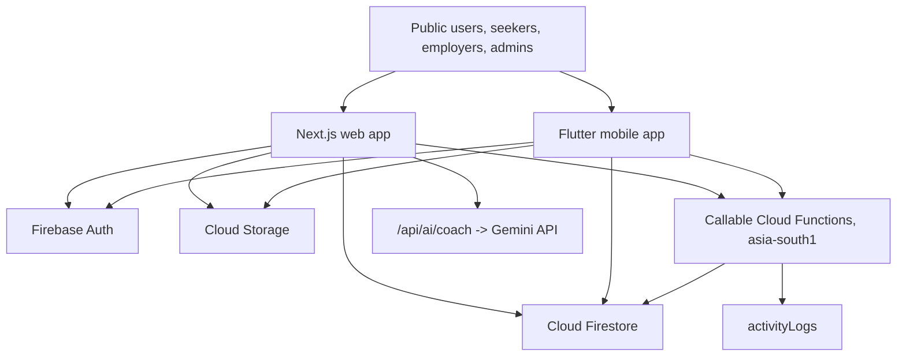
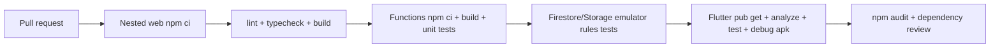

# THENIJOBS Enterprise Audit Report

Prepared: 2026-06-10  
Workspace reviewed: `E:\thenijobs-main`  
Primary apps found:

- Root web app: `E:\thenijobs-main`
- Canonical nested web + Firebase app: `E:\thenijobs-main\thenijobs-main`
- Flutter mobile app: `E:\thenijobs-main\thenijobs-flutter`

This is a source-level and local-build audit. It includes static code review, dependency audits, security-rule review, workflow tracing, and local command verification. It is not a production penetration test, Lighthouse field test, cloud billing export review, or live Firebase data audit.

---

## 1. Executive Summary

THENIJOBS is a broad multi-role job, business, services, and lead-generation platform with a Next.js web app, Firebase backend, Cloud Functions, Firestore/Storage rules, and a Flutter mobile app. The product surface is substantial: public discovery, seeker portal, employer/HR portal, admin portal, AI coach, messaging, subscriptions, notifications, reviews, leads, and mobile equivalents.

The strongest parts of the system are the breadth of workflow coverage, the improved server-owned application and moderation paths, the nested web app build health, and the now-expanded Firestore index file. The highest-risk areas are deployment ambiguity between the root and nested web apps, remaining client-owned Firestore writes, missing emulator regression tests, mobile release configuration, App Check/rate-limiting gaps, and analyzer/lint debt.

Overall verdict: the nested `thenijobs-main/` app is the best production candidate. The root web app should be treated as legacy or staging-only until the owner explicitly confirms otherwise. The Flutter app is useful as a shared Firebase client, but it is not release-ready until analyzer findings, release signing, native Firebase config, notification wiring, and platform permissions are completed.

---

## 2. Verification Evidence

| Area | Command / Evidence | Result |
|---|---|---|
| Root web lint | `npm run lint` in `E:\thenijobs-main` | Passed with 101 warnings |
| Root web build | `npm run build` in `E:\thenijobs-main` | Passed, Next.js 16.2.7 |
| Nested web lint | `npm run lint` in `E:\thenijobs-main\thenijobs-main` | Passed |
| Nested web typecheck | `npm run typecheck` | Passed |
| Nested web build | `npm run build` | Passed, 70 generated routes |
| Functions build | `npm --prefix functions run build` | Passed |
| Firestore indexes JSON | `JSON.parse(firestore.indexes.json)` | Passed |
| Flutter test | `D:\flutter\bin\flutter.bat test` | Passed, widget test OK |
| Flutter analyzer | `D:\flutter\bin\flutter.bat analyze` | Failed with 133 issues |
| Root npm audit | `npm audit` | 2 moderate advisories, Next/PostCSS |
| Nested npm audit | `npm audit` | 8 moderate advisories, mostly `firebase-admin` transitive chain |
| Functions npm audit | `npm audit` in `functions` | 8 moderate advisories |
| Flutter outdated | `flutter pub outdated` | 41 dependencies constrained below resolvable versions |

---

## 3. Final Scores

| Dimension | Score | Notes |
|---|---:|---|
| Architecture | 64 / 100 | Good feature separation, but duplicated web apps and large service files reduce governance. |
| Security | 58 / 100 | Rules are meaningful and privileged Functions now exist, but App Check, emulator tests, and remaining direct writes are gaps. |
| Performance | 61 / 100 | Builds pass and bundles are moderate; full collection reads and limited pagination remain. |
| SEO | 68 / 100 | Metadata, sitemap, robots exist; dynamic job/company pages need per-record metadata and structured data. |
| UI/UX | 72 / 100 | Strong responsive direction and rich portals; accessibility and consistency debt remain. |
| Mobile App | 56 / 100 | Broad routes and Firebase integration; analyzer, signing, FCM, release config block production. |
| Website | 74 / 100 | Nested app is functionally strong and buildable; root/nested divergence is the main website risk. |
| Database | 66 / 100 | Firestore model is workable and indexes improved; schema drift and rule tests still missing. |
| DevOps | 52 / 100 | CI exists for nested web only; no Functions, Flutter, audit, emulator, deploy preview, or release checks. |
| Overall Production Readiness | 63 / 100 | Good staging candidate after recent fixes; not production-complete yet. |

---

## 4. Architecture Overview

Key architecture findings:

| Priority | Issue Location | Problem | Impact | Recommended Fix |
|---|---|---|---|---|
| Critical | `E:\thenijobs-main` and `E:\thenijobs-main\thenijobs-main` | Two full web apps exist with different Next versions and hosting modes. | Wrong app can be built or deployed. Teams may patch one app while production runs another. | Declare nested app canonical, archive root app or convert it to docs-only. Add CI/deploy checks that run only against the canonical app. |
| High | `thenijobs-main/src/lib/firebase/firestoreService.ts`, `thenijobs-flutter/lib/core/services/firestore_service.dart` | Central service files are very large and combine reads, writes, admin actions, gamification, chat, and schema normalization. | Hard to test, high regression risk, repeated direct-write patterns. | Split by domain: jobs, companies, applications, notifications, chat, admin, gamification. |
| High | `thenijobs-flutter/lib/core/routes/route_screens.dart` | Generic route screen file is very large and owns many unrelated portal screens. | Analyzer debt, high cognitive load, difficult screen-level QA. | Split into public, seeker, employer, admin, shared list components. |
| Medium | Generated/log/audit artifacts in workspace | Many logs, reports, build outputs, `.next`, `out`, Flutter `build`, audit JSON files are present. | Repository noise and accidental deployment risk. | Keep source docs intentionally, ignore generated outputs, consolidate old audit reports. |

---

## 5. Project Structure Analysis

Observed source scale:

- 197 TSX files
- 36 TS files
- 63 Dart files
- 29 Markdown docs
- 26 JSON files
- Root app and nested app both contain full web source trees.

Safe removal candidates after owner confirmation:

| Candidate | Why it can be removed or ignored | Condition |
|---|---|---|
| Root `src/`, root `package.json`, root `firebase.json` | Duplicates the nested app but uses Next 16 static export and no Functions source. | Remove only if nested app is confirmed production canonical. |
| `node_modules/`, `.next/`, `out/`, Flutter `build/`, `.dart_tool/` | Generated dependency/build artifacts. | Should be ignored, never reviewed as source. |
| `thenijobs-main/audit-eslint*.json`, `audit-npm*.json`, build/deploy logs | Old generated audit/build output. | Keep only latest report artifacts. |
| Starter SVGs: `file.svg`, `globe.svg`, `next.svg`, `vercel.svg`, `window.svg` | Next starter assets, not product assets. | Remove if no component imports them. |
| `logo_backup.png` | Backup binary asset duplicates current logo intent. | Remove after confirming no fallback import. |
| Multiple older audit reports | Useful historically but confusing as source of truth. | Archive in `docs/audits/` with dates or keep only the latest. |
| `functions/lib/` | Generated TypeScript output for Functions. | Can be ignored if deploy/build always runs `npm --prefix functions run build`; keep only if deploy process intentionally requires committed build output. |

Files to refactor first:

- `thenijobs-main/src/lib/firebase/firestoreService.ts`
- `thenijobs-flutter/lib/core/services/firestore_service.dart`
- `thenijobs-flutter/lib/core/routes/route_screens.dart`
- `thenijobs-main/src/contexts/AuthContext.tsx`
- Admin pages still calling generic `updateDocument`, `createDocument`, or direct Firestore writes.

---

## 6. Website Analysis

### 6.1 Page Coverage

Nested web app routes include:

- Public: `/`, `/jobs`, `/jobs/[id]`, `/businesses`, `/businesses/[category]`, `/company/[slug]`, `/company/register`, `/services`, `/pricing`, `/id/[id]`, `/privacy`, `/terms`
- Auth: `/login`, `/register`, `/forgot-password`, `/admin/login`
- Seeker: dashboard, applications, interviews, job alerts, messages, notifications, profile, resume, resume builder, rewards, saved jobs, settings, skills, subscription, AI coach
- Employer: billing, candidates, company profile, dashboard, interviews, jobs, leads, messages, post job, reports, reviews, settings, subscription, talent search
- Admin: ads, businesses, dashboard, jobs, leads, notifications, reports, reviews, security, services, settings, subscriptions, users

### 6.2 Website Issues

| Priority | Issue Location | Problem Description | Impact | Recommended Fix |
|---|---|---|---|---|
| Critical | Root vs nested app | Deployment target is ambiguous. | Production may run stale root app while Functions and hardened workflows live in nested app. | Make nested app canonical in README, CI, Firebase config, and deployment scripts. |
| High | `src/lib/firebase/config.ts` in root app | Root app has hardcoded Firebase config fallbacks. | Wrong project can be used silently; public config is not secret but fallback governance is weak. | Match nested app behavior: require env vars and fail build/start if missing. |
| High | `thenijobs-main/src/app/seeker/notifications/page.tsx:45` | Marks notifications with `isRead`, while canonical model/rules use `read`. | Notifications can remain unread in other surfaces. | Migrate to `read: true`; add migration for old `isRead`. |
| High | `thenijobs-main/src/app/jobs/page.tsx:91` | Job listing loads matching jobs and filters mostly client-side. | Cost and latency grow with collection size. | Add server-backed pagination and query filters by status, district, category, type, salary bands. |
| High | `thenijobs-main/src/app/company/[slug]/page.tsx`, `jobs/[id]/page.tsx` | Dynamic pages have no per-record metadata or JSON-LD. | SEO value for jobs and companies is underused. | Generate metadata from Firestore/Admin snapshot or move to SSR/ISR with structured data. |
| High | `thenijobs-main/firestore.rules:184-208` | Public company reads likely expose owner/contact/verification fields if stored on same doc. | Business verification PII can leak through public directory reads. | Split `companiesPublic` or `companies/{id}/private/verification` subdocs. |
| Medium | Root lint output | Root app passes with 101 warnings. | Quality gate is too permissive for production. | Set unused imports/vars to fail in CI after cleanup. |
| Medium | `thenijobs-main/src/app/company/register/page.tsx` | ESLint reports an image missing alt text. | Accessibility issue. | Add meaningful `alt` or empty decorative alt. |
| Medium | Admin service/reviews/ads pages | Several admin actions still use generic direct Firestore writes. | Audit trail and validation can be inconsistent. | Move moderation/write actions to callables over time. |
| Medium | `thenijobs-main/next.config.ts` | Images are unoptimized. | Larger image payloads and weaker Core Web Vitals. | Use Firebase image resizing, CDN variants, or enable image optimization where hosting supports it. |
| Medium | Forms | Many forms are state-driven with limited shared validation; `zod` exists but is not consistently adopted. | Inconsistent validation across web/mobile/server. | Add shared schemas for companies, jobs, applications, reviews, leads, profiles. |
| Low | UI consistency | Some pages use custom controls while shared UI components exist. | Slightly uneven UX and maintenance overhead. | Standardize cards, tables, modals, empty states, and toasts. |

### 6.3 Responsive UX

Static review and prior responsive pass show the app uses mobile-first layout utilities, responsive grids, bottom navigation, constrained widths, and collapsible portal layouts. The build succeeds across all routes. A final QA pass should still run screenshots at:

- 320 px and 375 px mobile
- 768 px tablet
- 1024 px laptop
- 1440 px desktop

Responsive items to test manually:

- Admin tables on 320 px.
- Employer candidates and messages split views.
- Job detail application modal.
- Company registration gallery upload.
- Seeker resume builder.
- AI coach prompt/results panel.

---

## 7. Mobile App Analysis

### 7.1 Mobile Screens

The Flutter router includes public, auth, seeker, employer, and admin routes mirroring the website. The app uses Riverpod, GoRouter, Firebase Auth, Firestore, Storage, Functions, Hive, and custom shared models.

| Screen Area | Issue | Cause | Solution | Expected Result |
|---|---|---|---|---|
| Login | Demo login still exists. | `signInWithDemoAccount` appears in auth provider and login flow. | Gate demo login behind debug/flavor flag or remove for release. | No production bypass path. |
| Registration | Role list is broader than some portal maturity. | Roles exist for supplier/service provider but production workflows are not complete. | Hide incomplete roles or route them to clear onboarding state. | Users land in supported portals only. |
| Public jobs | Apply flow now calls callable path through service. | Recent hardening improved server-owned application creation. | Add integration test against Functions emulator. | One application per user/job, server-owned count/notification. |
| Public businesses/services | Uses Firestore service and models. | Good reuse, but public data may include fields not intended for mobile. | Split public/private company fields. | Mobile only receives safe public profile data. |
| Seeker profile/resume | Uses Firestore/Storage. | Direct writes are rule-protected but not emulator-tested. | Add rules tests for resume ownership and profile writes. | Safer uploads and profile updates. |
| Messages | Chat service exists. | Needs notification/read receipt hardening and index coverage. | Add chat rules tests and push notification integration. | Reliable inbox/read state. |
| Notifications | Firestore notification model uses `read`. | Web has `isRead` drift in one page. | Standardize to `read`. | Mobile and web show consistent unread counts. |
| Employer/admin actions | Sensitive actions now call Functions in `firestore_service.dart`. | Good direction, but other generic writes remain. | Continue callable migration for reviews, ads, services, settings. | Auditable admin workflows. |
| Offline handling | Hive is initialized only for local settings. | Firestore persistence/offline queue strategy is not explicit. | Define offline mode: cache read-only public data, queue safe writes, reject sensitive writes offline. | Predictable mobile behavior on weak networks. |
| Push notifications | `PushNotificationService` exists but no app-level initialization was found. | Service is not wired in `main.dart` or providers. | Register token, request permission, save token, handle foreground/background messages. | Real push delivery for job/application updates. |
| Release readiness | Android release signs with debug key. | `build.gradle.kts` uses `signingConfigs.getByName("debug")`. | Add release keystore config and CI secrets. | Play Store/TestFlight-ready builds. |
| Analyzer | 133 issues. | Deprecated APIs, unused imports/vars, warnings in route/UI files. | Clean analyzer backlog, upgrade lints. | CI can fail on analyzer without blocking release work. |

### 7.2 Mobile Release Blockers

| Priority | Location | Blocker | Fix |
|---|---|---|---|
| Critical | `thenijobs-flutter/android/app/build.gradle.kts:35-38` | Release uses debug signing. | Configure release signing with CI secrets. |
| High | `thenijobs-flutter/lib/core/config/firebase_config.dart` | Firebase options are hardcoded in Dart. | Generate/manage config through FlutterFire or flavor-specific build-time config. |
| High | Flutter project files | No `google-services.json`, `GoogleService-Info.plist`, or `firebase_options.dart` found. | Add native Firebase config for Android/iOS release pipelines. |
| High | Android manifest | No Android 13 `POST_NOTIFICATIONS` permission visible. | Add notification permission and runtime prompt. |
| High | Push service | `PushNotificationService` not wired. | Initialize in app startup/auth flow and store tokens. |
| Medium | Analyzer | 133 analyzer findings. | Clean or explicitly baseline non-release lints. |

---

## 8. Authentication and User Management

Observed authentication paths:

- Email/password login.
- Google OAuth login/register.
- Phone OTP login with Firebase recaptcha on web.
- Password reset.
- Role-based registration.
- Separate admin login route.
- Web portal guards via `useRequireAuth`.
- Flutter GoRouter auth redirects.

Findings:

| Priority | Location | Issue | Impact | Recommended Fix |
|---|---|---|---|---|
| High | `thenijobs-main/src/contexts/AuthContext.tsx` | Roles are stored/read from Firestore docs; custom claims are only updated for admin role changes in Functions. | Rule checks rely on Firestore reads; role tampering is mitigated by rules but costly and harder to audit. | Use custom claims for admin/super admin checks and keep Firestore role as display/profile state. |
| High | Admin login | Admin login checks Firestore role after sign-in. | Correct but should be backed by custom claims/MFA for high-risk accounts. | Enforce MFA for admin/super admin and custom claims in admin guard. |
| High | Mobile demo account | Demo login exists in mobile auth flow. | Production bypass or accidental demo access. | Compile out for release flavors. |
| Medium | Email verification | User creation stores `isVerified:false`, but email verification enforcement is not clearly complete. | Fake/unverified accounts can interact where only mobile verification is checked. | Enforce email verification for email/password users where appropriate. |
| Medium | Session policy | Admin security page exposes settings, but enforcement is unclear. | Admin session timeout/2FA toggles may be cosmetic. | Implement actual token refresh/session expiry behavior. |

---

## 9. HR Portal Analysis

Expected HR features:

- Search candidates.
- Review applications.
- Shortlist/reject/select.
- Schedule interviews.
- Download resumes.
- Contact candidates.
- See correct candidate visibility.
- Receive notifications.

Current status:

| Feature | Status | Issue | Required Change |
|---|---|---|---|
| Candidate profiles created | Partial | Seeker profile/resume pages write profiles; mobile models exist. | Add required profile-completion validation before applying. |
| HR can search candidates | Partial | Talent search exists, but privacy and query/rule design must be strict. | Use callable redacted candidate search with plan/rate limits. |
| HR can shortlist candidates | Yes | Application status callable exists. | Add emulator tests for employer ownership. |
| HR can download resumes | Partial | Resume URLs are tied to application/profile data; Storage reads are owner/admin only for direct object path. | Ensure resume links in applications use signed or rule-allowed access for legitimate employer reviewers. |
| HR can contact candidates | Partial | Messaging and contact flows exist; candidate PII visibility must be governed. | Show contact only for applicants or paid/unlocked candidates. |
| Candidate visibility | Needs hardening | Public/private profile boundary must be explicit. | Split seeker public profile from private resume/contact data. |
| Job application workflow | Improved | `applyToJob` callable owns uniqueness, counter, notification. | Add rules/functions emulator regression tests. |

Ideal HR workflow:

```mermaid
flowchart LR
  A["Employer creates company"] --> B["Admin approves company"]
  B --> C["Employer posts job"]
  C --> D["Admin approves job"]
  D --> E["Candidate applies"]
  E --> F["Employer reviews application"]
  F --> G["Shortlist or reject"]
  G --> H["Schedule interview"]
  H --> I["Select or reject"]
  I --> J["Candidate notification and audit log"]
```

---

## 10. Job Portal Workflow Analysis

Expected flow vs implementation:

| Step | Current Implementation | Gap |
|---|---|---|
| Candidate registration | Web and Flutter support email, Google, OTP paths. | Enforce email/mobile verification consistently. |
| Profile creation | Web seeker profile and resume pages; Flutter models/service. | Add completion score gate before applying. |
| Resume upload | Storage rules restrict resume writes. | Employer resume access needs verified review path. |
| Skill selection | Seeker skills page exists. | Use skills in job recommendations/search more consistently. |
| Job search | Web and Flutter listing pages exist. | Add server-side pagination and indexed filters. |
| Job apply | Callable `applyToJob` exists. | Add emulator tests and UI handling for all callable errors. |
| HR review | Employer candidates page exists. | Ensure application doc includes all needed redacted profile fields. |
| Shortlisting | Callable `updateApplicationStatus` exists. | Add ownership tests. |
| Interview scheduling | Web creates interview docs. | Move scheduling to callable with notification/audit. |
| Selection/rejection | Callable status update supports selected/rejected. | Add status transition validation. |
| Notification | Notifications are created server-side in core flows. | Standardize `read` field and wire push tokens. |

---

## 11. Database and Firestore Analysis

Main collections observed:

`users`, `companies`, `jobs`, `applications`, `savedJobs`, `jobAlerts`, `interviews`, `notifications`, `activityLogs`, `seekerProfiles`, `publicProfiles`, `services`, `reviews`, `leads`, `subscriptions`, `payments`, `paymentRequests`, `broadcasts`, `conversations`, `conversations/{id}/messages`, `gamification`, `gamification/{uid}/activities`, `settings`, `platformSettings`, `advertisements`, `supportTickets`.

Positive findings:

- Nested `firestore.indexes.json` now has 43 indexes covering jobs, companies, applications, saved jobs, job alerts, leads, interviews, reviews, subscriptions, payment requests, conversations, payments, and services.
- `activityLogs` client writes are denied in nested rules.
- Application creation is server-owned through callable workflow.
- Storage rules restrict resumes and verification docs to owner/admin.

Database issues:

| Priority | Collection / Location | Issue | Impact | Recommendation |
|---|---|---|---|---|
| Critical | Rules tests | No emulator regression test suite found. | Rules can regress silently. | Add `@firebase/rules-unit-testing` for web/functions and run in CI. |
| High | `companies` | Public and private company fields appear mixed. | Verification/contact PII exposure risk. | Split public/private company docs. |
| High | `notifications` | `read` vs `isRead` drift. | Bad unread counts and inconsistent mobile/web UX. | Standardize `read`; migrate old docs. |
| High | `settings` vs `platformSettings` | Two settings collections are used. | Admin settings drift and unclear ownership. | Consolidate to one settings document namespace. |
| Medium | `jobs` | `status`, `isActive`, `applicationCount`, historical `applicationsCount` appear. | Query and dashboard inconsistencies. | Canonicalize fields and run migration. |
| Medium | Query patterns | Some list screens still rely on client filtering. | Cost and latency growth. | Add cursor pagination and composite query planning per screen. |
| Medium | Denormalization | Jobs/applications/company snapshots store repeated names/contact fields. | Drift risk. | Define snapshot fields intentionally and reconcile with Functions. |

---

## 12. API and Backend Analysis

Backend surfaces:

- Callable Functions in `thenijobs-main/functions/src/index.ts`.
- Next route `thenijobs-main/src/app/api/ai/coach/route.ts`.
- Direct Firebase client SDK reads/writes.

Callable Functions currently include:

- `syncMobileVerification`
- `createJobPosting`
- `applyToJob`
- `updateApplicationStatus`
- `approveCompany`
- `rejectCompany`
- `approveJob`
- `rejectJob`
- `updateUserRole`
- `verifyUser`
- `setUserStatus`
- `deleteUserRecord`
- `sendBroadcast`
- `updateSubscriptionPlan`

Backend issues:

| Priority | Location | Issue | Impact | Fix |
|---|---|---|---|---|
| High | Callable Functions | Good validation exists, but no emulator tests. | Server business logic can regress. | Add Functions emulator tests for success/failure paths. |
| High | AI coach route | Uses Gemini API and Firestore plan limits, but no App Check or IP/user throttling beyond app data. | API abuse and cost exposure. | Add App Check, per-user/day/month counters, and request-size validation. |
| High | Direct client writes | Many non-core workflows still write Firestore directly. | Audit gaps and validation drift. | Move sensitive writes to callables in batches. |
| Medium | Error handling | UIs often convert errors to toast/console. | Users may not understand remediation. | Normalize callable error codes to user-friendly copy. |
| Medium | Broadcast | Function caps user queries at 1000 per role query. | Broadcasts may silently miss large audiences. | Implement paginated background task/Cloud Task fanout. |

---

## 13. Cloud, Hosting, DevOps, and Server Analysis

| Priority | Area | Finding | Impact | Fix |
|---|---|---|---|---|
| Critical | Deployment governance | Root and nested Firebase configs can deploy different apps. | High risk of wrong artifact in production. | One canonical deploy script; block root deploy unless intentionally selected. |
| High | CI | `thenijobs-main/.github/workflows/ci.yml` checks web lint/typecheck/build only. | Functions, Flutter, rules, audits, and emulator tests are not protected. | Expand CI matrix. |
| High | Functions runtime | `nodejs20` configured. | Good baseline, but dependency advisories exist. | Upgrade/test `firebase-admin` major after reading migration notes. |
| High | Mobile release | Android debug signing in release. | Cannot ship securely. | Add keystore secrets and release workflow. |
| Medium | Hosting headers | Nested hosting has basic security headers, root has stronger CSP. | Nested app lacks CSP. | Add CSP after validating scripts/connect domains. |
| Medium | Monitoring | No alerting/backup configuration found in repo. | Production incidents may go unnoticed. | Add Firebase alerts, Error Reporting/Sentry, budget alerts, backup export. |
| Medium | Backups | No scheduled Firestore export config found. | Data recovery risk. | Schedule managed Firestore exports to GCS. |

Recommended CI pipeline:

---

## 14. Security Audit

Security positives:

- Firestore rules use role and ownership helpers.
- `activityLogs` client writes are denied.
- Application creation is callable-owned.
- Job creation is callable-owned.
- Storage resumes and verification docs are owner/admin scoped.
- Admin portals use layout guards in nested app.

Security issues:

| Risk | Priority | Location | Problem | Fix |
|---|---|---|---|---|
| Data exposure | Critical | `companies` public read | Public reads may include private company verification/contact fields. | Split public/private docs. |
| Abuse prevention | Critical | Firebase web/mobile clients | No App Check initialization found. | Enable App Check for web and mobile clients and enforce in Firebase. |
| Privileged workflow regression | Critical | Rules/functions tests | No emulator tests. | Add rule and callable emulator suites. |
| Mobile release security | Critical | Android release signing | Debug signing is used for release. | Configure release signing. |
| API cost abuse | High | `/api/ai/coach` | AI endpoint needs stronger throttling/App Check. | Add App Check and strict counters. |
| Role authority | High | Firestore role docs | Admin role checks use Firestore role data; custom claims are only partially used. | Move admin authorization to custom claims. |
| Direct writes | High | Multiple admin/user pages | Some writes bypass server audit. | Callable migration. |
| Secrets/config | High | Flutter config, root config | Firebase config hardcoded in root and Flutter. | Use env/flavor config; rotate if needed. |
| XSS | Low | Search found no `dangerouslySetInnerHTML`, `innerHTML`, or `eval`. | Low current static risk. | Keep lint rule/blocklist. |
| CSRF | Low/Medium | Firebase SDK and callables | Auth tokens protect Firebase; AI route should enforce auth and App Check. | Keep route server-side only; validate origin/App Check. |

---

## 15. SEO Analysis

Positive:

- Nested app has `metadataBase`, title template, description, keywords, Open Graph, Twitter metadata.
- `robots.ts` and `sitemap.ts` exist.
- Privacy and terms pages exist.
- Static category pages exist.

Gaps:

| Priority | Location | Issue | Fix |
|---|---|---|---|
| High | `jobs/[id]`, `company/[slug]` | No per-record metadata or structured data. | Add dynamic `generateMetadata` and JSON-LD for `JobPosting` and `LocalBusiness`. |
| High | `sitemap.ts` | Sitemap has static/manual records, not live jobs/companies. | Generate sitemap from Firestore/Admin export or scheduled static generation. |
| Medium | Images | Image optimization is disabled. | Add proper image transforms and dimensions. |
| Medium | Content | Some pages are rich client components, weak server-rendered crawlable content. | Move SEO-critical summaries server-side. |
| Medium | Local SEO | Theni/Tamil Nadu targeting exists but needs structured local business/job markup. | Add schema and canonical URLs. |

SEO score: 68 / 100.

---

## 16. Performance Analysis

Performance positives:

- Root and nested builds pass.
- Nested build shared JS is around 102 KB plus page chunks.
- Several home sections use Firestore `limit`.
- Firebase hosting static asset caching is configured.

Performance issues:

| Priority | Location | Problem | Impact | Fix |
|---|---|---|---|---|
| High | Listing pages | Many screens fetch broad collections and filter client-side. | Cost/latency grows quickly. | Cursor pagination and indexed filters. |
| High | Admin dashboards | Stats rely on multiple live reads/counts. | Dashboard load can get expensive. | Aggregation docs maintained by Functions. |
| Medium | Images | `images.unoptimized: true`. | Higher bandwidth and worse LCP. | Use resized images and stable dimensions. |
| Medium | Flutter | Large route/service files can rebuild heavy screens. | UI jank risk. | Split widgets and use providers/selectors. |
| Medium | Messaging | Realtime listeners need bounds. | Large threads can load too much. | Paginate messages and load latest first. |

Performance score: 61 / 100.

---

## 17. UI/UX Review

Strengths:

- Rich, modern product surface.
- Clear public, seeker, employer, admin navigation.
- Responsive web patterns are broadly present.
- Mobile app mirrors most high-level routes.
- Tamil/English labels appear in navigation and product language.

Issues:

| Priority | Area | Issue | Recommendation |
|---|---|---|---|
| High | Mobile Flutter | Analyzer warnings include deprecated APIs and unused state. | Clean analyzer before release. |
| Medium | Accessibility | Missing alt warning in company registration; icon-only controls need labels/tooltips. | Add labels, alt text, focus states, keyboard QA. |
| Medium | Forms | Validation differs page-to-page. | Shared schemas and consistent error display. |
| Medium | Admin tables | Need mobile table/card QA at 320/375 px. | Add screenshot tests and responsive table cards. |
| Medium | Feedback | Some actions rely on console/errors or basic prompts. | Standardize toast/modal confirmations. |

UI/UX score: 72 / 100.

---

## 18. Feature Gap Analysis

Modern job portal features still missing or partial:

| Feature | Status | Priority | Effort |
|---|---|---:|---:|
| Server-side candidate search with privacy filters | Partial | High | 4-6 days |
| Resume parsing/ATS scoring | Missing | Medium | 8-12 days |
| Job recommendations by skills/location | Partial | Medium | 5-8 days |
| Employer team seats and permissions | Missing | Medium | 5-7 days |
| Interview calendar integration | Partial | Medium | 4-6 days |
| Email and push transactional notifications | Partial | High | 4-7 days |
| Payment gateway with webhook verification | Partial/manual | High | 5-8 days |
| Fraud/spam moderation queue | Partial | High | 3-5 days |
| Public SEO landing pages by job/category/location | Partial | Medium | 5-8 days |
| Data export and compliance tools | Missing | Medium | 4-6 days |
| Admin audit dashboard | Partial | High | 3-5 days |
| Backup/restore runbook | Missing | High | 1-2 days |

---

## 19. Website and Mobile Synchronization Matrix

| Feature Name | Website | Mobile App | Issue | Required Changes |
|---|---|---|---|---|
| Public home | Yes | Yes | Mobile uses separate Flutter UI. | Keep content taxonomy synced. |
| Job listing | Yes | Yes | Query/filter behavior may differ. | Shared filter schema and indexed queries. |
| Job detail | Yes | Yes | SEO richer on web needed. | Add metadata; keep model fields synced. |
| Apply to job | Yes | Yes | Callable path exists. | Add emulator tests and UI error handling. |
| Business directory | Yes | Yes | Public/private data split needed. | Shared public company DTO. |
| Company profile | Yes | Yes | Slug/ID resolution must match. | Add shared identifier rules. |
| Services marketplace | Yes | Yes | Moderation direct writes remain. | Callable for service approval/rejection. |
| Seeker dashboard | Yes | Yes | Metrics may differ. | Shared aggregation docs. |
| Seeker profile | Yes | Yes | Private/public profile boundaries. | Separate DTOs. |
| Resume upload | Yes | Partial/Service-backed | Employer access path needs review. | Signed/review-scoped resume access. |
| Saved jobs | Yes | Yes | Good basic parity. | Add duplicate tests. |
| Job alerts | Yes | Yes | Delivery automation unclear. | Scheduled matching Function. |
| Applications | Yes | Yes | Good parity after callable update. | Status transition tests. |
| Interviews | Yes | Yes | Scheduling still partially direct. | Callable scheduling. |
| Notifications | Yes | Yes | `read` vs `isRead` drift. | Migrate to `read`. |
| Messaging | Yes | Yes | Push not wired. | Token registration and FCM handlers. |
| Rewards/gamification | Yes | Yes | Direct writes remain. | Server award rules. |
| AI coach | Yes | Partial/route present | API route is web-side; mobile equivalent unclear. | Expose callable/API with App Check. |
| Skills | Yes | Partial/route present | Data model sync needed. | Shared skill taxonomy. |
| Subscriptions | Yes | Yes | Payment gateway/webhook missing. | Server-verified subscription flow. |
| Employer company profile | Yes | Yes | Gallery limits and plan rules need tests. | Emulator and callable coverage. |
| Employer post job | Yes | Yes/service | Callable exists. | Integration test. |
| Employer candidates | Yes | Yes/generic | Resume/contact policy needs hardening. | Redacted application DTO. |
| Talent search | Yes | Partial | Privacy/rules and plan limits need server search. | Candidate-search callable. |
| Admin users | Yes | Yes/generic | Web uses callables for core user actions. | Add mobile admin UI tests. |
| Admin companies/jobs | Yes | Yes/generic | Core approvals callable-backed. | Expand audit logs and tests. |
| Admin services/reviews/ads | Yes | Yes/generic | Still direct-write heavy. | Callable migration. |
| Admin reports/analytics | Yes | Yes/generic | Aggregations approximate. | Server-maintained analytics docs. |
| Admin security/settings | Yes | Yes/generic | Settings enforcement unclear. | Implement actual policies. |

---

## 20. Admin Panel Analysis

Admin panel coverage:

- User management: yes.
- Business/company moderation: yes.
- Job moderation: yes.
- Leads: yes.
- Reviews: yes.
- Services: yes.
- Ads: yes.
- Notifications/broadcasts: yes.
- Reports: yes.
- Security/settings: yes.
- Subscriptions: yes.

Missing or incomplete admin functions:

| Priority | Function | Gap | Fix |
|---|---|---|---|
| High | Rule test dashboard | No regression visibility. | Add CI status and emulator test docs. |
| High | Audit logs | Activity logs exist, but many direct writes still bypass server logging. | Move privileged writes to Functions and log all. |
| High | Payment requests | Callable exists but UI approval flow is not fully wired. | Add approve/reject payment request UI. |
| High | Candidate privacy controls | No dedicated admin policy screen. | Add profile visibility settings and audit. |
| Medium | Support tickets | Rules mention tickets but admin surface is not prominent. | Add support inbox. |
| Medium | Admin MFA/session policy | UI exists but enforcement unclear. | Implement real MFA/session controls. |
| Medium | Data export | No clear export tooling. | Add CSV exports with audit logs and role checks. |

---

## 21. Critical Issues

| ID | Area | Issue | Impact | Fix | Effort |
|---|---|---|---|---|---:|
| C1 | Deployment | Root and nested web apps create canonical-target ambiguity. | Wrong app can ship. | Declare/automate nested canonical deploy; archive root. | 1 day |
| C2 | Security | No App Check enforcement found. | Public Firebase abuse/scraping and API abuse risk. | Add web/mobile App Check and enforce. | 1-2 days |
| C3 | Testing | No Firestore/Storage/Functions emulator test suite found. | Rules and callables can regress silently. | Add emulator tests and CI. | 2-4 days |
| C4 | Mobile release | Android release uses debug signing. | Cannot securely release. | Configure signing and CI secrets. | 1 day |
| C5 | Data privacy | Public company reads may expose private verification/contact data. | Business PII exposure. | Split public/private company data. | 2-3 days |
| C6 | Notification schema | `isRead` vs `read` field drift. | Broken unread states. | Migrate and standardize. | 0.5 day |

---

## 22. High Priority Issues

| ID | Area | Issue | Fix | Effort |
|---|---|---|---|---:|
| H1 | Mobile | Flutter analyzer fails with 133 issues. | Clean analyzer or baseline non-release lints. | 2 days |
| H2 | Dependency security | npm audits show moderate advisories. | Upgrade Next/PostCSS path and `firebase-admin` major with tests. | 1-2 days |
| H3 | CI | CI only covers nested web. | Add Functions, Flutter, audit, emulator jobs. | 1-2 days |
| H4 | Backend | Broadcast fanout caps at 1000 per query. | Paginated fanout/background task. | 2-3 days |
| H5 | SEO | Dynamic jobs/companies lack record metadata/JSON-LD. | Add `generateMetadata` and structured data. | 2-4 days |
| H6 | Performance | Broad list reads and client filtering. | Cursor pagination and indexed filters. | 4-6 days |
| H7 | Mobile push | Push service exists but is not wired. | Register tokens and foreground/background handlers. | 2-4 days |
| H8 | Settings | `settings` and `platformSettings` drift. | Consolidate schema. | 1 day |
| H9 | Direct writes | Admin services/reviews/ads/settings still client-write. | Callable migration. | 3-5 days |
| H10 | AI route | Needs App Check/throttling/cost controls. | Add counters and App Check. | 1-2 days |

---

## 23. Medium Priority Issues

| Area | Issue | Fix | Effort |
|---|---|---|---:|
| Code quality | 307 TypeScript `any` matches across web code. | Tighten types by domain. | 3-5 days |
| Root code quality | Root lint has 101 warnings. | Remove unused imports and a11y warning. | 1 day |
| Flutter dependencies | 41 dependencies constrained below resolvable versions. | Batch upgrades. | 2-4 days |
| Image performance | `images.unoptimized` and mixed assets. | Use optimized image pipeline. | 2-3 days |
| Admin UX | Mixed table/card/action patterns. | Standard admin design system. | 2-4 days |
| Accessibility | Alt labels, icon labels, focus states need pass. | A11y test and fixes. | 2-3 days |
| Documentation | Many older audit/docs conflict. | Consolidate docs. | 0.5-1 day |
| Mobile offline | Hive only used for settings. | Define offline cache/queue policy. | 3-5 days |

---

## 24. Low Priority Issues

| Area | Issue | Fix |
|---|---|---|
| Assets | Starter SVGs and backup logos. | Remove after import check. |
| Logs | Old local logs clutter workspace. | Add cleanup script and ignore rules. |
| UI copy | Some placeholder/default labels remain. | Copy QA pass. |

---

## 25. 30-Day Plan

1. Confirm canonical app and lock deploy pipeline to `thenijobs-main/`.
2. Add CI for nested web, Functions, Flutter test/analyze, npm audit, and emulator tests.
3. Add emulator tests for `users`, `companies`, `jobs`, `applications`, `notifications`, `activityLogs`, `seekerProfiles`, Storage resumes, and verification docs.
4. Fix notification schema drift: migrate `isRead` to `read`.
5. Enable Firebase App Check for web and mobile clients.
6. Split company public/private data.
7. Configure Android release signing and native Firebase configs.
8. Clean Flutter analyzer warnings that can block CI.
9. Upgrade Node dependency advisories in controlled batches.
10. Wire payment request approvals to `updateSubscriptionPlan`.

---

## 26. 60-Day Plan

1. Move service/review/ad/settings admin actions to callable Functions.
2. Add callable interview scheduling with audit logs and notifications.
3. Implement cursor pagination and server/index-backed filtering.
4. Add aggregation docs for dashboard stats and revenue.
5. Add push notification token registration and FCM handlers.
6. Add per-record SEO metadata and JSON-LD for jobs and companies.
7. Split large web and Flutter service files by domain.
8. Add shared validation schemas or DTOs for web/mobile/functions.
9. Add accessibility QA and keyboard/focus tests.
10. Consolidate settings collections and old audit docs.

---

## 27. 90-Day Plan

1. Build privacy-safe candidate search callable with subscription limits.
2. Add verified payment gateway and webhook processing.
3. Build scheduled job-alert delivery.
4. Add resume parsing and skill-based recommendations.
5. Add admin export tools and compliance audit logs.
6. Add Firestore backup/restore runbook and scheduled exports.
7. Add monitoring, budget alerts, and production error tracking.
8. Add Lighthouse/screenshot regression tests for 320, 480, 768, 1024, and 1440 px.
9. Add mobile release pipeline for debug, staging, and production flavors.
10. Define data retention and deletion workflows.

---

## 28. Database Optimization Plan

1. Keep the nested `firestore.indexes.json` as canonical.
2. Add emulator tests before changing rules.
3. Add aggregation docs: `stats/global`, `stats/company/{id}`, `stats/seeker/{id}`.
4. Canonical fields:
   - `notifications.read`
   - `jobs.applicationCount`
   - `companies.verificationStatus`
   - `companies.isActive`
   - one settings namespace
5. Migrate historical fields:
   - `isRead` to `read`
   - `applicationsCount` to `applicationCount`
   - old company status variants to `verificationStatus`
6. Add pagination to all list screens.
7. Split private docs:
   - `companies/{id}/private/verification`
   - `seekerProfiles/{uid}/private/contact`
   - `applications/{id}` contains review-safe snapshot only.

---

## 29. Website Optimization Plan

1. Root/nested app consolidation.
2. Add App Check and CSP to nested hosting.
3. Add dynamic metadata and structured data.
4. Optimize images and remove starter assets.
5. Add page-level loading/error/empty states.
6. Replace broad reads with paginated query hooks.
7. Replace generic writes with callable domain actions.
8. Add Playwright responsive screenshots.

---

## 30. Mobile App Optimization Plan

1. Fix release signing.
2. Add native Firebase config files or generated FlutterFire options.
3. Wire FCM token lifecycle and notification handlers.
4. Remove/gate demo login.
5. Clean analyzer to zero warnings or accepted baseline.
6. Split `route_screens.dart` and `firestore_service.dart`.
7. Add offline/cache policy.
8. Add widget/integration tests for login, public browse, apply, notifications, and admin workflows.

---

## 31. Security Hardening Plan

1. App Check enforcement for Firestore, Storage, Functions, and AI route.
2. Custom claims for admin/super admin authorization.
3. MFA for admin/super admin.
4. Callable-only privileged workflows.
5. Activity logs for every admin and server-owned action.
6. Public/private document split.
7. Rate limits for leads, reviews, broadcasts, AI coach, OTP-sensitive flows.
8. Emulator rules tests in CI.
9. Dependency upgrade cadence.
10. Backup, monitoring, and incident response runbook.

---

## 32. Scalability Plan

1. Replace list-wide client filtering with paginated indexed queries.
2. Maintain counters/aggregates in Functions.
3. Fan out broadcasts with background pagination.
4. Paginate chat messages and conversations.
5. Add queue/scheduled jobs for job alerts, expiring jobs, subscription renewal checks.
6. Use Storage image variants/CDN caching.
7. Use BigQuery export or scheduled reports for analytics at scale.

---

## 33. Final Conclusion

THENIJOBS is no longer a simple prototype. It is a multi-surface marketplace with enough feature depth to justify production hardening. The nested web app and Functions are the correct base for production. Recent callable workflow work materially improves application and moderation trust, but the platform still needs canonical deploy governance, App Check, emulator tests, mobile release setup, schema cleanup, and CI expansion before it should be treated as production-ready.

Recommended immediate owner decision: confirm `E:\thenijobs-main\thenijobs-main` as canonical and freeze root app deployments. Everything else becomes much easier once that boundary is clear.
