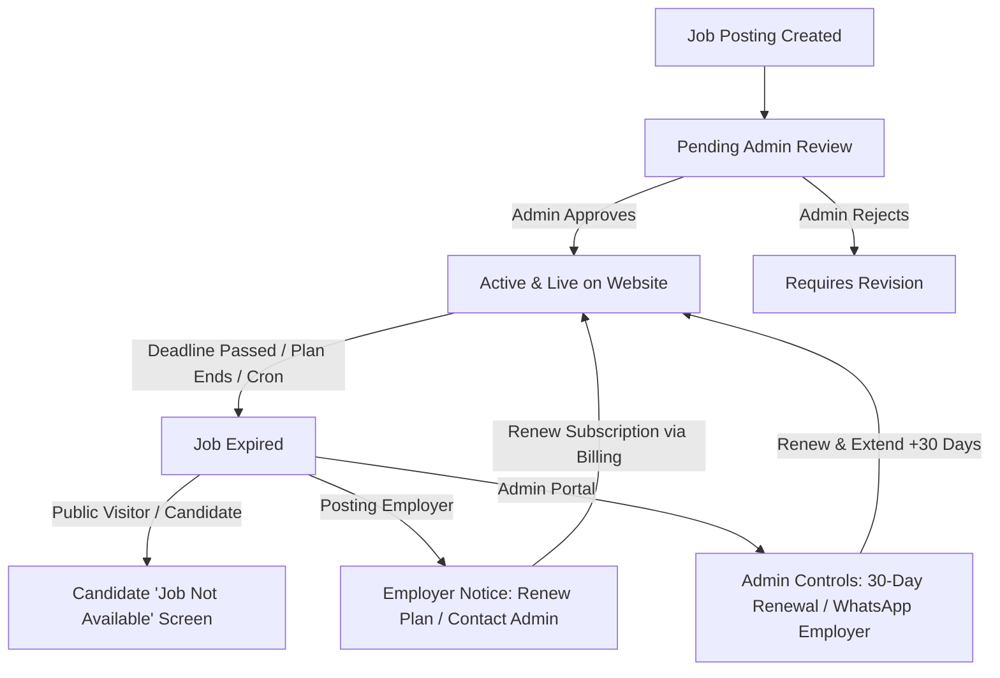

# THENIJOBS — Complete Platform Features Guide (TOTAL_FEATURES.md)

> **The Comprehensive Hyperlocal Job Portal, Business Directory, Service Marketplace & Digital Website Builder for Theni District & Tamil Nadu**  
> **Production URL:** [www.thenijobs.com](https://www.thenijobs.com) | [www.thenijobs.in](https://www.thenijobs.in)  
> **Official Support:** +91 93605 19460 / +91 70948 26886 | info@thenijobs.com  
> **Headquarters:** North Street, A.M. Patty, Uthamapalayam, Theni District, Tamil Nadu, India  
> **Platform Version:** October 2026 Release (Full Server Next.js 16.3.4 Production Architecture)

---

## 📑 Table of Contents

1. [Executive Summary & Platform Architecture](#1-executive-summary--platform-architecture)
2. [User Roles & Access Control](#2-user-roles--access-control)
3. [Job Lifecycle, Expiry, 30-Day Renewal & 7-Day SLA](#3-job-lifecycle-expiry-30-day-renewal--7-day-sla)
4. [Public Discovery, Homepage & Search Hub](#4-public-discovery-homepage--search-hub)
5. [Hyperlocal & Regional Job Portals (SEO Landing Pages)](#5-hyperlocal--regional-job-portals-seo-landing-pages)
6. [Job Seeker Portal (`/seeker/*`)](#6-job-seeker-portal-seeker)
7. [Employer & Business Owner Portal (`/employer/*`)](#7-employer--business-owner-portal-employer)
8. [Admin & Platform Supervision Portal (`/admin/*`)](#8-admin--platform-supervision-portal-admin)
9. [Village Ambassador & Referral Network (`/ambassador/*`)](#9-village-ambassador--referral-network-ambassador)
10. [No-Code Website Builder (16 Company + 3 Seeker Templates)](#10-no-code-website-builder-16-company--3-seeker-templates)
11. [Product & Service Marketplace with WhatsApp Flow](#11-product--service-marketplace-with-whatsapp-flow)
12. [AI Gateway, Bring-Your-Own-Key (BYOK) & Smart Automation Suite](#12-ai-gateway-bring-your-own-key-byok--smart-automation-suite)
13. [Digital Identity & Visiting Cards (QR Codes)](#13-digital-identity--visiting-cards-qr-codes)
14. [Payment, Subscriptions & Automated Invoicing](#14-payment-subscriptions--automated-invoicing)
15. [Authentication, Security, Storage & Maintenance Infrastructure](#15-authentication-security-storage--maintenance-infrastructure)
16. [Design System, Component Library & Bilingual Localization](#16-design-system-component-library--bilingual-localization)
17. [Complete Route, Page & API Inventory](#17-complete-route-page--api-inventory)

---

## 1. Executive Summary & Platform Architecture

**THENIJOBS** is a high-performance, multi-sided hyperlocal web platform specifically engineered for job seekers, recruiters, local micro-enterprises, service professionals, and enterprise corporations across Theni district and Tamil Nadu.

### 1.1 Core Technology Stack
* **Framework:** Next.js 16.3.4 (App Router running as a full Next.js server app on Vercel)
* **Runtime & Language:** React 19.2.4, TypeScript 5.x
* **UI & Styling:** Tailwind CSS v4, Framer Motion (`^12.40.0`), Radix UI Primitives (`@radix-ui/react-checkbox`, `@radix-ui/react-dialog`, `@radix-ui/react-progress`), Lucide React (`^1.17.0`), Recharts (`^3.8.1`), Tailwind Merge (`^3.6.0`), CLSX (`^2.1.1`)
* **Typography:** Inter (Body) + Poppins (Headings) optimized via `next/font/google`
* **PDF & Media Generation:** `jspdf` (`^4.2.1`), `html2canvas` (`^1.4.1`), `qrcode` (`^1.5.4`), `xlsx` (`^0.18.5`)
* **AI Provider Integrations:** Multi-tier gateway routing:
  * Google Gemini API (`@google/generative-ai` `^0.24.1`)
  * Groq Cloud (`groq-sdk` `^1.5.0` with `llama-3.3-70b-versatile` / `openai/gpt-oss-120b`)
  * OpenAI API (`openai` `^7.4.0`)
* **Cloud & Serverless Infrastructure:**
  * **Firebase Authentication:** Email/Password, Google OAuth, Indian Phone (+91) OTP via 2Factor.in / Phone Auth + Voice Call OTP fallback
  * **Cloud Firestore:** Real-time NoSQL database guarded by **763 lines** of production security rules
  * **Firebase Storage:** Secure document and media storage with **119 lines** of hardened MIME/size rules
  * **Firebase Admin SDK:** `firebase-admin` (`^14.3.0`) for privileged server-side operations (webhook verification, cron jobs, ID token validation)
  * **Hosting & CDN:** Vercel server deployment with HTTP security headers (HSTS, CSP, X-Frame-Options, nosniff), image optimization, clean URLs, and scheduled cron jobs
  * **Analytics & Telemetry:** Google Analytics 4 (`NEXT_PUBLIC_GA_MEASUREMENT_ID`), Global Client Error Tracker, and React Error Boundaries
* **Payments & Billing:** 256-bit SSL Razorpay Checkout with server-side HMAC-SHA256 signature verification, webhook processing, and automated PDF tax invoice generator

---

## 2. User Roles & Access Control

The platform provides dedicated, guarded dashboard portals and permission matrices for distinct user roles:

| Role | Role Identifier | Primary Capabilities | Guarded Portal |
|---|---|---|---|
| **Job Seeker** | `job_seeker` | Search & apply to jobs, AI resume builder, career coach, digital ID card, portfolio website, settings sync, Bring-Your-Own-Key AI | `/seeker/*` |
| **Employer / HR** | `employer` | Post jobs, candidate tracking pipeline, interview scheduling, talent search, resume access, subscription management | `/employer/*` |
| **Business Owner** | `business_owner` | Company profile, showcase products/services, 16 website templates, digital business visiting card, multi-branch addresses | `/employer/*` |
| **Supplier / B2B** | `supplier` | List wholesale/retail products, catalog management, receive WhatsApp purchase leads | `/employer/*` & `/marketplace` |
| **Service Provider** | `service_provider` | Showcase services, accept customer booking inquiries, quote prices | `/employer/*` & `/marketplace?type=services` |
| **Village Ambassador** | `ambassador` | Referral link tracking, WhatsApp sharing kits, commission ledger, UPI payout requests | `/ambassador/dashboard` |
| **Administrator** | `admin` | Moderation of jobs, companies, user accounts, reviews, subscriptions, dynamic slogans, and platform configuration | `/admin/*` |
| **Super Admin** | `super_admin` | Full control over revenue, AI gateways, SEO, district franchise rules, master credentials | `/admin/*` |

---

## 3. Job Lifecycle, Expiry, 30-Day Renewal & 7-Day SLA

The platform enforces a strict, role-based job visibility and renewal protocol designed to protect candidates while empowering recruiters and administrators:



### 3.1 Strict Role Visibility Matrix for Expired Jobs

| Viewer Role | What Is Displayed | Actions Available |
| :--- | :--- | :--- |
| **Public Visitor / Candidate** | **Candidate-Friendly "Job Not Available" Screen**<br>• Job details hidden.<br>• Filtered out from public search (`/jobs`) and Homepage Trending.<br>• **NO** admin WhatsApp number or internal renewal links exposed. | • Click **"Browse All Active Jobs"** to view active vacancies in Theni. |
| **Employer (Job Owner)** | **Specialized Employer Notice & Warning Banner**<br>• Shown on `/employer/jobs` under dedicated **"Expired"** tab.<br>• Shown on `/jobs/[id]` as an owner notice: *"Your Job Posting Has Expired"*. | • 💳 **Renew Plan** (direct to `/employer/billing`).<br>• 💬 **Contact Admin to Renew** (direct WhatsApp link to `+91 93605 19460`).<br>• View all applications received prior to expiration. |
| **Admin Portal** | **Admin Moderation & Renewal Hub**<br>• Listed under dedicated **"Expired"** tab with real-time KPI badge on `/admin/jobs`.<br>• Shown on `/jobs/[id]` as an admin banner: *"This Job Has Expired — Hidden from Public Website"*. | • 🚀 **Renew & Extend (+30 Days)**: One-click deadline reset & automatic reactivation.<br>• 💬 **WhatsApp: Ask Employer to Renew**: Pre-filled WhatsApp notification sent to employer with direct billing link.<br>• ✏️ **Re-Approve & Moderate**: Re-approve with automatic +30 day deadline extension. |

### 3.2 Automated Nightly Cron Job (`/api/cron/expire-jobs`)
* Configured in `vercel.json` to execute nightly at `01:00 UTC` (`schedule: "0 1 * * *"`).
* Scans all Firestore jobs with `status: 'active'` whose `deadline` or `expiryDate` has passed.
* Marks them `status: 'expired'`, `isActive: false`, and logs the operation to `activityLogs`.
* Authenticated using `CRON_SECRET` timing-safe bearer token check and `x-vercel-cron` header verification.

### 3.3 Automated Trial & Subscription Expiry Cron Job (`/api/cron/expire-trials`)
* Configured in `vercel.json` to execute daily at `00:00 UTC` (`schedule: "0 0 * * *"`).
* **Batch 1 (15-Day Free Trial Expiry):** Scans company profiles whose trial period (`trialEndDate`) has lapsed without an active paid subscription (`paymentStatus != 'paid'`), transitioning them to `subscriptionStatus: 'trial_expired'` and `accountStatus: 'suspended'`.
* **Batch 2 (Paid Annual Subscription Expiry):** Scans paid company subscriptions (`paymentStatus: 'paid'`) whose 1-year period (`subscriptionEndDate`) has passed, transitioning them to `subscriptionStatus: 'subscription_expired'` and `accountStatus: 'suspended'`.
* Automatically suspends public directory profiles & connected websites (`websiteStatus: 'suspended'`), updates associated employer user accounts, creates actionable notifications, and logs audit entries in `activityLogs`.
* Authenticated using `CRON_SECRET` timing-safe bearer token check and `x-vercel-cron` header verification.

### 3.4 7-Day Employer Response SLA System
* On `/admin/jobs`, a dedicated **"Overdue Apps"** tab monitors candidate applications that have remained unreviewed by employers for more than 7 days.
* Administrators have immediate **"Call Employer"** and **"WhatsApp Follow-up"** buttons with pre-filled candidate reminder text to prompt swift recruiter response.

---

## 4. Public Discovery, Homepage & Search Hub

Accessible without authentication, optimized for rapid discovery, instant contact, and search engines:

### 4.1 Homepage Components (`src/components/home`)
* **AnnouncementBar (`AnnouncementBar.tsx`):** Top bar broadcasting flash job alerts, government exams, walk-in drives, and platform updates.
* **HeroSection (`HeroSection.tsx`):** Dynamic search input (Keyword + Location) with live auto-suggestions, platform metrics counters, and real-time live local job updates ticker.
* **TrustedEmployersStrip (`TrustedEmployersStrip.tsx`):** Logo marquee of top verified companies and institutions hiring in Theni.
* **TrendingJobs (`TrendingJobs.tsx`):** Carousel featuring high-priority openings with ⚡ *Urgent* and ⭐ *Premium* tags (auto-filtered to exclude expired listings).
* **WalkInDriveBanner (`WalkInDriveBanner.tsx`):** Dedicated promo highlight for upcoming offline walk-in interviews and mega job fairs across the district.
* **CategoriesSection (`CategoriesSection.tsx`):** Browse top 12+ industry categories with Tamil subtitles, opening counts, and icon indicators.
* **FeaturedBusinesses (`FeaturedBusinesses.tsx`):** High-definition company cards with uncropped banners, category pills, and theme backdrop blur.
* **ServicesSection (`ServicesSection.tsx`):** Highlights top local service providers (plumbers, electricians, AC mechanics, accountants).
* **WhySection (`WhySection.tsx`):** Value proposition comparison showing why THENIJOBS delivers 10x faster local hiring than national job portals.
* **HowItWorksSection (`HowItWorksSection.tsx`):** 3-step visual guide for candidates and employers.
* **JobSeekerEmployerCTA (`JobSeekerEmployerCTA.tsx`):** Dual registration CTA cards for candidates and hiring managers.
* **LocationsSection (`LocationsSection.tsx`):** Quick-link chips for all Theni taluks and neighboring hubs.
* **FAQSection (`FAQSection.tsx`):** Accordion FAQ addressing common candidate and recruiter queries with FAQPage structured data schema.
* **FinalCTA (`FinalCTA.tsx`):** High-conversion bottom banner for candidate onboarding.
* **HomeFooter (`HomeFooter.tsx`):** Comprehensive footer with district office address, phone helplines, WhatsApp links, and legal routes.
* **ClientFloatingWidgets (`ClientFloatingWidgets.tsx`):** Floating WhatsApp customer helpline button (`+91 93605 19460`) and smooth back-to-top button.

### 4.2 Job Directory (`/jobs` & `/jobs/[id]`)
* **Multi-Filter System:** Filter by category, job type (Full-time, Part-time, Remote, WFH, Internship, Fresher, Contract), district/taluk, experience level, and salary ranges.
* **Expiry Filtration:** Automatically filters out expired postings from public view.
* **Job Cards:** Company logo, verified badge, salary range in INR, number of openings, application deadline, and required skills tags.
* **Interactive Job Details (`/jobs/[id]`):** Complete job description, responsibilities, eligibility, company overview, Google Map location, similar job recommendations, and 1-click **"Apply Now"** modal.
* **Social Sharing:** One-click share to WhatsApp, Facebook, LinkedIn, Twitter, and native clipboard.

### 4.3 Business Directory & Company Profiles (`/businesses`, `/company/[slug]`, `/[companySlug]`)
* **Categorized Directory:** Search local companies across manufacturing, textile, agriculture, retail, healthcare, etc.
* **Full Company Showcase:**
  * Uncropped 1200x400 business banners with backdrop blur.
  * Verified badges (Mobile, Email, GST, Business Registration).
  * Direct Call, Email, and WhatsApp contact buttons.
  * Embedded interactive Google Map and turn-by-turn navigation.
  * Photo gallery and video showcase.
  * Active job openings posted by the company.
  * Customer reviews and 5-star rating breakdown.
* **Company Registration (`/company/register` & `/register-business`):** Multi-step onboarding for local business owners.

### 4.4 Services Marketplace (`/marketplace?type=services`)
* Browse local certified technicians, electricians, plumbers, legal consultants, accounting, photographers, and tailoring services.
* Direct contact buttons and WhatsApp quotation request forms.
* Note: `/services` permanently redirects to `/marketplace?type=services` via `next.config.ts`.

---

## 5. Hyperlocal & Regional Job Portals (SEO Landing Pages)

Dedicated, search-engine-optimized landing pages targeting specific taluks and neighboring districts in Tamil Nadu:

* **Theni Hub:** `/jobs-in-theni` (and category-specific pages `/jobs-in-theni/[category]`)
* **Andipatti:** `/jobs-in-andipatti`
* **Bodinayakanur:** `/jobs-in-bodinayakanur`
* **Chinnamanur:** `/jobs-in-chinnamanur`
* **Cumbum:** `/jobs-in-cumbum`
* **Periyakulam:** `/jobs-in-periyakulam`
* **Uthamapalayam:** `/jobs-in-uthamapalayam`
* **Madurai:** `/jobs-in-madurai`
* **Dindigul:** `/jobs-in-dindigul`
* **Daily Fresh Jobs Stream:** `/daily-jobs` (Aggregated live stream of today's freshest local job postings).

Each page includes localized schema markup (`JobPosting` and `BreadcrumbList`), taluk-specific introduction text, and pre-filtered active jobs.

---

## 6. Job Seeker Portal (`/seeker/*`)

A full-fledged personal career hub with AI tools, ATS resume builder, application tracking, and personal website generator:

### 6.1 Dashboard & Navigation (`/seeker/dashboard`)
* **Profile Strength Meter:** Visual percentage gauge (0–100%) indicating missing profile items.
* **"Open to Work" Toggle:** Instant availability badge visible to recruiters.
* **KPI Metrics:** Applied Jobs count, Shortlisted count, Scheduled Interviews count, Saved Jobs count.
* **Personalized Job Recommendations:** Tailored openings matching the user's skill set and district.

### 6.2 Comprehensive Profile Builder (`/seeker/profile`, `/seeker/skills`)
* **Personal Data:** Name, phone, email, full address, district, state, profile avatar.
* **Work Experience:** Multiple entries with company name, designation, start/end dates, roles, achievements.
* **Education History:** School/College, degree, specialization, graduation year, percentage/CGPA.
* **Categorized Skills Matrix (`/seeker/skills`):** Multi-select and proficiency levels across 45+ predefined tech, trade, and regional skills.
* **Certifications & Languages:** Upload certificates and specify spoken/written language proficiency.
* **Career Preferences:** Desired job roles, expected monthly salary (INR), preferred districts, work mode.

### 6.3 AI-Powered ATS Resume Builder (`/seeker/resume/builder`)
* **Auto-Populate from Profile:** 1-click sync pulling personal details, education, work experience, and skills directly from Firestore.
* **AI Bullet Point Generator & Optimizer:** Integrated Google Gemini assistant that converts basic work descriptions into ATS-friendly, quantified achievements with action verbs.
* **Dual-Mode High-Definition Export:**
  1. High-resolution canvas-based PDF generation (`html2canvas` + `jsPDF`) with mobile-safe margins.
  2. Vector-crisp native browser print engine (`window.print()`) formatted for standard A4 paper.
* **Cloud Storage Sync:** 1-click save to user's Firestore resume vault and downloadable link generation.
* **Resume AI Analysis (`/seeker/resume/analyze`):** Automated ATS score, keyword density checker, and improvement suggestions.

### 6.4 Career Coaching & AI Suite (`/seeker/ai-coach`, `/seeker/ai-chat`, `/seeker/ai`)
* **AI Career Coach:** Chatbot providing interview preparation, situational question answers, and salary negotiation tips.
* **Cover Letter Generator:** Auto-generates customized cover letters tailored to specific job postings.
* **Bring-Your-Own-Key (BYOK) Integration:** Connect personal OpenAI or Google Gemini API key with a one-time ₹50 setup fee (grants permanent key connection).

### 6.5 Applications & Interview Pipeline
* **Track Applications (`/seeker/applications`):** Real-time status pipeline:
  $$\text{Applied} \longrightarrow \text{Shortlisted} \longrightarrow \text{Interview Scheduled} \longrightarrow \text{Selected / Rejected}$$
* **Interview Tracker (`/seeker/interviews`):** Displays date, time, interview mode (In-person, Phone call, Google Meet/Zoom link), and venue directions.
* **Saved Jobs (`/seeker/saved-jobs`):** Bookmark interesting openings for later review.
* **Job Alerts (`/seeker/job-alerts`):** Automated notifications based on preferred keywords and locations.

### 6.6 Personal Portfolio & Digital ID Card
* **Personal Portfolio Website (`/seeker/website`):** Build a personal online portfolio hosted at `/portfolio/seeker/[id]` or `/portfolio/[username]`. Includes Minimal, Executive, and Creative layouts with a ₹50/year public privacy toggle.
* **Seeker Digital ID Card (`/seeker/id-card`):** Official digital identity card with photo, verified badge, skills list, and a scan-to-verify QR code.
* **Public Profile Privacy Control:**
  * Requires explicit opt-in (`isPortfolioPublic: true`) unlocked by the ₹50/year fee.
  * Granular masking options: `hidePhone`, `hideEmail`, `hideAddress`, `hideResume`, `hideContact`.

### 6.7 Account & Notification Settings (`/seeker/settings`)
* **Live Firestore Persistence:** Settings are securely stored and synced in real-time with `seekerProfiles/{uid}.notificationPreferences`.
* **Multi-Channel Alert Matrix:** Granular toggles across **Push App**, **SMS Phone**, **Email**, and **WhatsApp** for:
  * Job Alerts matching saved criteria.
  * Application Updates (Shortlist, Selection, Review).
  * Interview Reminders (24-hour and 1-hour notices).
  * Direct Hiring Messages from local employers.
  * Career Offers & Job Fair Events in Theni.

---

## 7. Employer & Business Owner Portal (`/employer/*`)

A complete recruitment CRM, business directory management suite, and digital presence manager:

### 7.0 Golden Access Control Rule & 15-Day Free Trial Guard
* **Trial Access Boundary:** Employers on the 15-day Standard free trial have targeted access strictly limited to:
  1. `/employer/post-job` — Multi-Step Job Posting Engine (allowing post creation under Standard plan quota).
  2. `/employer/company-profile` — Company Profile, Logo, Media & Contact Details.
  3. `/employer/billing` — Subscription Tiers, Plan Checkout & Invoice History.
* **Paid Plan Gate:** Advanced ATS candidate pipelines (`/employer/candidates`), resume search (`/employer/talent-search`), interview scheduling (`/employer/interviews`), CRM leads (`/employer/leads`), and website builders (`/employer/website/*`) require an active paid subscription (`paymentStatus === 'paid'`).
* **Client Guard (`/employer/layout.tsx`):** If a trial employer navigates to restricted routes, an inline alert banner appears with quick-action links to Post Job, Update Profile, or Upgrade to a Paid Plan.
* **Server-Side Authority:** API routes and server reconciliation independently enforce access permissions; client UI parameters are never trusted.

### 7.1 Employer Dashboard (`/employer/dashboard`)
* High-level metrics: Active Job Posts, Total Applicants Received, New Inquiries/Leads, Company Profile Views.
* Recent applicant activity feed with fast-action shortlist/reject buttons.

### 7.2 Job Posting & Management Engine (`/employer/post-job`, `/employer/jobs`)
* **Rich Job Creator:** Post jobs with title, industry, vacancies, job type, salary range, experience requirement, detailed descriptions, and perks.
* **Urgency & Promotion Flags:** Tag postings as ⚡ *Urgent Hiring*, ⭐ *Premium Job*, or 📌 *Featured Listing*.
* **Job Management (`/employer/jobs`):**
  * Tabs: All, Active, Pending, Closed, and **Expired**.
  * Status Pills: Real-time indication of Active, Under Review, Requires Revision, and Expired.
  * **Expired Jobs Alert Banner:** Prompts employer to renew plan via `/employer/billing` or contact Admin via WhatsApp (`+91 93605 19460`).
  * ActionMenu items: Edit, View applicants, Close posting, Renew subscription, and Contact Admin.

### 7.3 Candidate Applicant Tracking System (ATS) (`/employer/candidates`)
* **Pipeline Management:** Visual Kanban/List tracker for candidates:
  * *Applied:* Review candidate profile, resume PDF, and contact details.
  * *Shortlisted:* Mark high-potential candidates.
  * *Interview Scheduled:* Trigger calendar invite with meeting link or address.
  * *Selected / Rejected:* Close applicant status with optional feedback note.
* **Talent Search Database (`/employer/talent-search`):** Search verified job seekers by skill keywords, experience level, and Tamil Nadu district.

### 7.4 Interview Coordination (`/employer/interviews`)
* Schedule interviews with automated time slots, notes, and platform reminders.

### 7.5 Business Leads & Customer CRM (`/employer/leads`)
* Dedicated lead management pipeline for local businesses receiving product/service inquiries:
  $$\text{New Lead} \longrightarrow \text{Contacted} \longrightarrow \text{Qualified} \longrightarrow \text{Converted} \ / \ \text{Lost}$$
* Record notes, lead value, customer phone numbers, and follow-up dates.

### 7.6 Company Profile & Media Center (`/employer/company-profile`)
* Edit company details: Logo, 1200x400 cover banner, tagline, founding year, company size, GST & registration numbers.
* Multi-branch management (add multiple physical shop/office addresses in different towns).
* Photo gallery and video embedding.
* Customer reviews management and reply system.

### 7.7 Digital Visiting Card & Staff ID Cards (`/employer/id-card`)
* **Company Visiting Card:** High-resolution digital business card with company branding, contact icons, Google Map pin, and quick WhatsApp share.
* **Dynamic QR Code:** Scan-to-save contact (.vcf) and view company website.
* **Staff ID Generator:** Create verified digital employee ID cards for company staff (up to 25 staff on Premium, unlimited on Enterprise).

### 7.8 Employer Settings & Notification Sync (`/employer/settings`)
* **Live Firestore Persistence:** Synced directly with `companies/{companyId}.notificationPreferences`.
* Controls alerts for New job applications, Customer reviews & ratings, Product & service inquiries, Interview confirmations, and System updates.

---

## 8. Admin & Platform Supervision Portal (`/admin/*`)

Centralized governance, moderation, dynamic slogans, and business intelligence portal:

### 8.1 Security & Session Management
* Dedicated admin initialization screen (`/admin/login`) with credential verification.
* Session destruction on logout and protection via client-side role guards (`useRequireAuth(['admin', 'super_admin'])`).
* Context banner and quick search toolbar across all admin views (`AdminContextBanner.tsx`, `AdminQuickSearch.tsx`).

### 8.2 Platform KPIs & System Health (`/admin/dashboard`)
* **Real-Time Counters:** Total Registered Users, Active Companies, Published Jobs, Total Applications, Lead Volume, and Platform Revenue (INR).
* **System Health Monitor:** Server uptime tracker, Firebase resource usage, active sessions, and API latency.
* **Regional Distribution Charts:** Visual analytics displaying user and company density across Theni, Madurai, Dindigul, and other districts.

### 8.3 Content Moderation & Verification
* **User Ledger (`/admin/users`, `/admin/users/create`):** Search, filter, edit, activate, suspend, or delete any user account across all roles. Toggle verified badges (Mobile, Email, Business, GST).
* **Business Moderation (`/admin/businesses`):** Approve or reject pending company submissions. Manage *Featured* and *Premium* directory placements.
* **Bulk Business Import (`/admin/businesses/import`):** Upload Excel / CSV spreadsheets to import hundreds of local business listings in batch.
* **Job Post Moderation (`/admin/jobs`):**
  * Filter by All, Pending, Active, Expired, Overdue Apps, Rejected, and Featured.
  * 🚀 **Renew & Extend (+30 Days):** Instantly renews expired listings in 1 click.
  * 💬 **WhatsApp: Ask Employer to Renew:** Direct pre-filled WhatsApp renewal link.
  * ⏱️ **7-Day Overdue Application SLA:** Track unreviewed candidate applications and contact employers directly via phone or WhatsApp.
* **Review & Rating Governance (`/admin/reviews`):** Moderate public reviews, flag inappropriate content, and resolve disputes.

### 8.4 Dynamic Slogans Engine (`/admin/slogans`)
* Custom interface and API (`/api/admin/slogans`, `/api/admin/slogans/reset`, `/api/admin/slogans/[id]`) to edit, add, or reset dynamic motivational growth slogans across:
  * 12+ Seeker Career Roles (Software, Sales, Marketing, Accounting, Engineering, Agriculture, Healthcare, Education, Hospitality, Driving, Management, etc.).
  * 14+ Company Business Categories (Retail, Manufacturing, Healthcare, Hotel, Education, Agriculture, Automobile, IT, Construction, etc.).
  * Official Billing Receipts and Invoices.

### 8.5 Revenue & Subscription Controls (`/admin/subscriptions`)
* Audit every Razorpay transaction, payment slip, active plan, start date, and renewal date.
* Manually override, extend, or activate subscriptions for offline bank transfers.

### 8.6 AI Engine Configuration (`/admin/ai-settings`, `/admin/ai-analytics`)
* Configure AI fallback priorities: Groq vs. Gemini vs. OpenAI.
* Set per-plan free credit allowances and adjust credit consumption rates per feature.
* Monitor token usage, API latency, and credit pack purchase revenue.

### 8.7 Platform Configuration & SEO Master (`/admin/settings`, `/admin/seo`)
* **Category & District Builders:** Add or modify job categories, business sectors, and Tamil Nadu taluk listings without code changes.
* **Maintenance Mode Switch:** Toggle site-wide maintenance on/off (backed by `platformSettings/public.maintenance`). Admin routes and login remain accessible.
* **SEO Metadata Controls:** Set global meta titles, OpenGraph images, and JSON-LD schema definitions.
* **System Notification Broadcasts (`/admin/notifications`):** Send platform-wide announcements or targeted push notifications.
* **Error Log Diagnostics (`/admin/errors`):** Real-time diagnostic viewer for client-side and API runtime issues.

---

## 9. Village Ambassador & Referral Network (`/ambassador/*`)

A localized referral growth engine empowering local youth, college students, and panchayat representatives across Theni:

* **Public Ambassador Landing (`/ambassador`):** Highlights program benefits, 1-minute registration form, commission structure, and video explainer.
* **Ambassador Dashboard (`/ambassador/dashboard`):**
  * Unique referral tracking link with 1-click WhatsApp copy & share.
  * Digital marketing kit: Pre-designed WhatsApp status cards, posters, and Tamil captions.
  * Live metrics: Businesses referred, jobs posted through link, verified candidates onboarded, total earnings (INR).
  * **UPI Payout Requests:** Ambassadors enter their Google Pay / PhonePe / Paytm UPI ID to request commission disbursements.
* **Commission Structure (per `AMBASSADOR_COMMISSIONS` in `src/lib/constants.ts`):**
  * Basic Plan (₹999): **₹150** commission
  * Standard Plan (₹1,800): **₹350** commission
  * Premium Plan (₹3,500): **₹700** commission
  * Enterprise Plan (₹5,000): **₹1,000** commission
* **Admin Ambassador Governance (`/admin/ambassadors`):**
  * Review new ambassador applications.
  * Verify referrals and audit commission payouts.
  * Mark UPI payout transactions as processed with reference IDs.

---

## 10. No-Code Website Builder (16 Company + 3 Seeker Templates)

THENIJOBS features an integrated, no-code website builder that creates dedicated websites for local companies and job seekers:

### 10.1 16 Company Website Templates (by Subscription Tier)

| Plan Tier | Template Name | Component File | Key Focus & Included Sections |
|---|---|---|---|
| **Free** | `classic-business` | `ClassicBusiness.tsx` | Clean, professional local shop presence: Hero, About, Services, Gallery (6), Contact, Map, Social |
| **Free** | `clean-corporate` | `CleanCorporate.tsx` | Minimal corporate branding: Hero, About, Services, Contact, Social |
| **Free** | `modern-services` | `ModernServices.tsx` | Service-focused cards with enquiry buttons: Hero, About, Service Cards, Gallery, WhatsApp Enquiry |
| **Standard** | `professional-company` | `ProfessionalCompany.tsx` | Comprehensive SME presentation: Hero, Products, Services, Testimonials, Map, Colors |
| **Standard** | `business-showcase` | `BusinessShowcase.tsx` | Product catalog with direct ordering: Featured Products, Categories, Reviews, WhatsApp Order |
| **Standard** | `local-business-pro` | `LocalBusinessPro.tsx` | Optimized for local search & foot traffic: Working Hours, Map + Directions, Reviews, Local SEO |
| **Premium** | `corporate-premium` | `CorporatePremium.tsx` | Established firms with hiring needs: Advanced Hero, Team, Projects, Careers, Animations |
| **Premium** | `product-marketplace` | `ProductMarketplace.tsx` | E-commerce style product catalog: Full Catalog, Categories, Search, Related Items |
| **Premium** | `service-marketplace` | `ServiceMarketplace.tsx` | Multi-service pricing & booking: Service Catalog, Pricing Tiers, Inquiries, FAQ |
| **Premium** | `executive-company` | `ExecutiveCompany.tsx` | Law, finance, and consulting firms: Leadership Profiles, Case Studies, Clients, Careers |
| **Premium** | `creative-business` | `CreativeBusiness.tsx` | Agencies, design, and digital studios: Bento-Grid, Video, Case Studies, Dynamic Animations |
| **Premium** | `modern-business` | `ModernBusiness.tsx` | Split hero SaaS-style company presentation: Split Hero, Quick Stats, Avatars, Working Hours Schedule |
| **Enterprise** | `enterprise-corporate` | `EnterpriseCorporate.tsx` | Large factories, corporations, and groups: News & Updates, All Sections, Multi-branch, Careers |
| **Enterprise** | `luxury-brand` | `LuxuryBrand.tsx` | High-end retail, jewellery, and textiles: Full-screen Hero, Brand Story, Collections, Typography |
| **Enterprise** | `business-careers` | `BusinessCareers.tsx` | Corporate talent recruitment portal: Job Listings, Company Culture, Online Applications |
| **Enterprise** | `ultimate-business-pro` | `UltimateBusinessPro.tsx` | The ultimate all-in-one corporate site: All 26+ Sections, AI Assistant, Custom Branding, Multi-branch |

### 10.2 3 Seeker Portfolio Templates

| Template Name | Component File | Key Focus & Layout |
|---|---|---|
| **Minimal** | `SeekerPortfolioMinimal.tsx` | Clean, typographic, distraction-free resume layout emphasizing contact, role, skills, and work timeline. |
| **Executive** | `SeekerPortfolioExecutive.tsx` | High-impact corporate profile with executive summary, key accomplishments, verified credential badges, and leadership experience. |
| **Creative** | `SeekerPortfolioCreative.tsx` | Modern bento-grid visual layout with project showcase thumbnails, GitHub links, skill pills, and video intro player. |

* Rendered dynamically via `SeekerPortfolioRenderer.tsx` and edited via `SeekerSiteEditor.tsx`.

### 10.3 31 Modular Section Types
Hero Banner, About Us, Services, Products, Team Members, Photo Gallery, Testimonials, Projects, Careers Portal, Contact Info, FAQ Accordion, Timeline / History, Achievements & Stats, Client Logos, News / Press, Custom HTML/Markdown, Leadership Team, CEO Message, Branch Locations, Awards & Accreditations, Portfolio Grid, Case Studies, Video Embeds, Social Links, Working Hours, Interactive Google Maps, Seeker Skills, Seeker Experience, Seeker Education, Seeker Certifications, and Download Resume.

### 10.4 In-Editor AI Content Assistant (`AIContentAssistant.tsx`)
* Generate company headlines, about-us bios, service descriptions, and mission statements with 1 click using Google Gemini.

---

## 11. Product & Service Marketplace with WhatsApp Flow

A lightweight, localized e-commerce experience designed for Indian commerce behavior:

* **Product Cards & Modal (`ProductDetailModal.tsx`):** Displays product photo, title, pricing in INR, description, specifications, and availability.
* **1-Click WhatsApp Direct Order Message:** Clicking "Order on WhatsApp" automatically opens WhatsApp with a pre-filled, formatted order slip:
  ```text
  🛍️ *PRODUCT ORDER / SERVICE ENQUIRY*
  ─────────────────────────
  📌 *Item:* [Product Name]
  💰 *Price:* ₹[Price]
  🏢 *Company:* [Company Name]
  📍 *Location:* [District], Tamil Nadu
  🖼️ *Photo:* [Product Image URL]
  🔗 *THENIJOBS Marketplace:* [Link]
  📝 *Customer Note:* [User Order Note]
  ─────────────────────────
  Hi, I found your listing on THENIJOBS Marketplace and would like to order / get more information.
  ```

---

## 12. AI Gateway, Bring-Your-Own-Key (BYOK) & Smart Automation Suite

A centralized, multi-provider AI infrastructure (`src/lib/ai/`) that powers intelligent features across the entire platform:

### 12.1 Bring-Your-Own-Key (BYOK) Architecture (`AIConnectionSettings.tsx`)
* **Personal Key Connection:** Job seekers and employers can connect their personal OpenAI (`gpt-4o-mini`, `gpt-4o`, etc.) or Google Gemini (`gemini-2.0-flash`, `gemini-1.5-flash`, etc.) API keys.
* **Seeker One-Time Connection Fee:** ₹50 one-time fee (`AI_CONNECTION_FEE_INR`) grants permanent rights to connect and update API keys.
* **Employer Access:** Included at zero additional platform cost on Enterprise plans.
* **Server-Side Security:**
  * Keys are masked and validated via `/api/ai/connections/test` before saving.
  * Verified Firebase ID token authentication on all connection routes.
  * Unlinking preserves the user's permanent entitlement.

### 12.2 16 Specialized AI Capabilities

| Feature Key | Description | Credit Cost |
|---|---|---|
| `job_search` | Natural language job search query interpreter | 1 credit |
| `job_recommendation` | Match candidate profiles with suitable active jobs | 1 credit |
| `career_assistant` | 24/7 AI chat answering career guidance questions | 1 credit |
| `profile_improvement` | Analyzes profile and recommends improvements | 1 credit |
| `resume_improvement` | Rewrites resume bullet points with quantifiable metrics | 2 credits |
| `resume_analysis` | Evaluates ATS compatibility and skill gaps | 2 credits |
| `cover_letter` | Generates personalized job application cover letters | 2 credits |
| `interview_prep` | Creates role-specific interview Q&A mock sessions | 2 credits |
| `full_resume_generation` | Synthesizes an entire professional resume from scratch | 3 credits |
| `company_description` | Generates compelling company bios and taglines | 1 credit |
| `service_product_description`| Writes sales copy for products and services | 1 credit |
| `job_description` | Generates comprehensive job postings for HR | 1 credit |
| `candidate_matching` | Calculates match percentage between candidate & job | 2 credits |
| `candidate_ranking` | Ranks applicant pool by relevance and qualifications | 2 credits |
| `candidate_search` | AI-assisted search across talent database | 1 credit |
| `chatbot` | Public-facing company AI chatbot for website visitors | 1 credit |

### 12.3 AI Credit Packs & Pricing

| Credit Pack | Credits | Price (INR) | Value Tag |
|---|---|---|---|
| **Starter Pack** | 10 Credits | ₹10 | Starter |
| **Popular Pack** | 25 Credits | ₹20 | Most Popular |
| **Value Pack** | 50 Credits | ₹35 | Best Value |
| **Pro Pack** | 100 Credits | ₹60 | Professional |

---

## 13. Digital Identity & Visiting Cards (QR Codes)

Instant digital networking tools for both candidates and enterprises:

* **Seeker Digital ID Card (`SeekerIDCard.tsx`):**
  * Displays Candidate Photo, Name, Verified Badge, Primary Skill Tag, District, and THENIJOBS Member ID.
  * Encoded QR Code linking to candidate's online public portfolio.
  * Download as crisp PNG / PDF image for easy sharing on WhatsApp.
* **Company Digital Visiting Card (`CompanyIDCard.tsx`):**
  * Displays Company Logo, Official Name, Category, GST/Reg Badge, Phone, WhatsApp, and Address.
  * Scan-to-Save Contact: Generates a standard vCard (.vcf) QR code that adds contact info directly to smartphone address books.
  * Staff ID Cards: Generate branded employee badges under the company account.

---

## 14. Payment, Subscriptions & Automated Invoicing

Transparent, annual pricing architecture with automated checkout and receipts:

### 14.1 Employer Annual Subscription Plans

| Feature / Tier | Basic (₹999/yr) | Standard (₹1,800/yr) | Premium (₹3,500/yr) | Enterprise (₹5,000/yr) |
|---|---|---|---|---|
| **Monthly Equivalent** | ₹83 / mo | ₹150 / mo | ₹292 / mo | ₹417 / mo |
| **Daily Cost** | ₹2.74 / day | ₹4.93 / day | ₹9.59 / day | ₹13.69 / day |
| **Active Job Postings** | 5 Jobs | 10 Jobs | 50 Jobs | **Unlimited** |
| **Job Alerts** | 5 Alerts | 10 Alerts | 50 Alerts | **Unlimited** |
| **Product Catalog** | None | 20 Products | 100 Products | **Unlimited** |
| **Service Listings** | None | 10 Services | 50 Services | **Unlimited** |
| **Gallery & Media** | 6 Images | 10 Images + 2 Videos | 50 Images + 10 Videos | **Unlimited** |
| **Website Templates** | 1 Basic Template | 5 Templates | 15 Templates | **All 16 + Custom** |
| **Digital Visiting Card** | Basic Card | Silver Badge + Card | Gold Badge + 25 Staff | Platinum + Unlimited Staff |
| **Branches** | 1 Location | 3 Branches | 20 Branches | **Unlimited Branches** |
| **AI Assistant** | None | Basic | Full Access | **Dedicated Chatbot** |
| **Search Priority** | Standard | Elevated | Top Featured | **Homepage Featured** |
| **Ambassador Payout** | ₹150 | ₹350 | ₹700 | ₹1,000 |

### 14.2 Job Seeker Plans & Micro-Purchases
* **Pro Candidate Plan (`/seeker/subscription`):** ₹199 / quarterly (₹2/day equivalent). Includes:
  * Featured candidate badge shown to recruiters first.
  * Direct WhatsApp chat links with verified employers.
  * Priority application review (marked as Premium Candidate).
  * Unlimited active job alerts.
  * AI Coach mock interviews & resume review.
  * Instant SMS & WhatsApp alerts for high-match jobs.
* **Seeker Public Profile Fee (`SEEKER_PUBLIC_PROFILE_FEE_INR`):** ₹50 / year (Unlocks public portfolio at `/portfolio/seeker/[id]` with server webhook verification).
* **AI Key Connection Fee (`AI_CONNECTION_FEE_INR`):** ₹50 one-time fee (Unlocks connecting personal OpenAI/Gemini API key permanently).
* **Resume Builder Direct Export:** ₹15 one-time fee for standalone users.

### 14.3 Automated Invoicing & Tax Slips
* Upon payment completion, an official tax receipt is generated instantly:
  * Receipt Number: `THENI-REC-[RANDOM-HASH]`
  * Customer Name, Billing Address, Plan Name, Amount Paid, GST breakdown.
  * **"Download Receipt (PDF)"** button produces an official invoice.

---

## 15. Authentication, Security, Storage & Maintenance Infrastructure

Robust, enterprise-grade security protocols across client and cloud:

* **Triple Authentication Flow:**
  * Email + Password with password reset link via Firebase Auth.
  * Mobile Phone OTP verification (+91) via 2Factor.in / Firebase SMS gateway.
  * **Voice Call OTP Fallback:** Automated voice call delivery via `/api/otp/call` with server rate limiting (max 3 calls per 5 minutes).
  * One-tap Google OAuth popup login.
* **Firestore Security Rules (`firestore.rules` — 763 lines):**
  * Granular access controls, helper functions, and schema validations.
  * Moderation checks: Suspended/banned users blocked from mutating state.
  * Strict ownership checks: Users can only modify their own profiles, resumes, and company assets.
  * Public read access restricted strictly to verified, active jobs, public company profiles, and public marketplace items.
  * Expired jobs protected from unauthorized public mutation.
* **Storage Rules (`storage.rules` — 119 lines):**
  * Resumes (`resumes/{uid}/*`): Restricted to PDF files under 5MB, readable only by the owner and authenticated employers.
  * Company Media: Restricted to valid image/video MIME types under 10MB.
* **Maintenance Mode Gate (`MaintenanceGate.tsx`):**
  * Powered by `platformSettings/public.maintenance` in Firestore.
  * When active, visitors see a friendly maintenance message.
  * `/admin/**` and `/login` are automatically exempt so administrators can log in and manage the site.
  * Fail-safe by default (site renders normally if Firestore read is unavailable).

---

## 16. Design System, Component Library & Bilingual Localization

Engineered for local Tamil Nadu demographics with high usability and aesthetics:

### 16.1 Unified Dashboard Component Kit (`src/components/dashboard`)
* `ActionMenu`: Accessible dropdown menu for table rows, cards, and list items.
* `DataTable`: Data table with search, sorting, multi-status filters, and pagination.
* `StatGrid`: Key metric summary cards with trend arrows and badge counters.
* `Tabs`: Accessible tab navigation with badges and icons.
* `Surface`: Glassmorphic, bordered, and elevated card containers.
* `Pill`: Status tags (Active, Pending, Expired, Urgent, Verified, etc.).
* `Switch`: Accessible toggle control for boolean preferences and settings.
* `ViewToggle`: Grid vs. List view switcher.
* `Toolbar`: Action bar with search input, filter chips, and primary buttons.
* `EmptyState`: Contextual empty state illustrations with action buttons.
* `Skeleton`: Shimmer placeholder loading states for text, avatars, and cards.
* `PageHeader`: Standardized dashboard header with breadcrumbs, title, and action slot.

### 16.2 Bilingual English + Tamil Support
* All major navigation items, buttons, form headers, and category titles include Tamil translations (e.g. `Jobs / வேலைகள்`, `Post Job / வேலை பதிவிடு`, `Dashboard / டாஷ்போர்ட்`).

### 16.3 Role Color Pillars
* **Job Seeker Portal:** Emerald / Cyan theme (`--seeker-*`).
* **Employer Portal:** Blue / Indigo / Cyan theme (`--employer-*`).
* **Admin Portal:** Violet / Indigo theme (`--admin-*`).

---

## 17. Complete Route, Page & API Inventory

### Public Pages
* `/` — Platform Homepage (Hero, SearchHub, Featured, Stats, Live ticker, Walk-in banner)
* `/jobs` — Searchable Job Directory with filters (auto-excludes expired jobs)
* `/jobs/[id]` — Dynamic Job Detail & Application View (role-based access; candidate-safe "Job Not Available" screen for expired jobs)
* `/businesses` — Business Directory
* `/businesses/[category]` — Category Filtered Business Listings
* `/companies` & `/companies/[slug]` — Company Profile directory
* `/company/[slug]` & `/[companySlug]` — Public Business Profile & Catalog
* `/company/register` & `/register-business` — Business Registration Onboarding
* `/services` — Redirects permanently to `/marketplace?type=services`
* `/marketplace` — Product & Service Marketplace
* `/marketplace/[type]/[companySlug]/[itemId]` — Product & Service Detail View
* `/portfolio/[username]` — Public Business Website View
* `/portfolio/seeker/[id]` — Public Seeker Portfolio View (opt-in gated by ₹50/yr fee)
* `/pricing` — Subscription Plans & Feature Matrix
* `/daily-jobs` — Daily Stream of New Jobs
* `/jobs-in-theni` (+ categories) — Theni District Local Jobs
* `/jobs-in-andipatti` (+ categories) — Andipatti Local Jobs
* `/jobs-in-bodinayakanur` (+ categories) — Bodinayakanur Local Jobs
* `/jobs-in-chinnamanur` (+ categories) — Chinnamanur Local Jobs
* `/jobs-in-cumbum` (+ categories) — Cumbum Valley Local Jobs
* `/jobs-in-periyakulam` (+ categories) — Periyakulam Local Jobs
* `/jobs-in-uthamapalayam` (+ categories) — Uthamapalayam Local Jobs
* `/jobs-in-madurai` (+ categories) — Madurai Region Jobs
* `/jobs-in-dindigul` (+ categories) — Dindigul Region Jobs
* `/about` — About Us & Mission
* `/contact` — Contact Details, Office Address & Support Form
* `/privacy` — Privacy Policy & Data Handling
* `/terms` — Terms of Service
* `/cookies` — Cookie Policy

### Ambassador & Referral Routes
* `/ambassador` — Public Village Ambassador Landing & 1-Minute Registration
* `/ambassador/dashboard` — Ambassador Portal (Referral Link, WhatsApp Sharing Kit, Earnings & UPI Payouts)

### Auth Routes
* `/login` — Unified Login (Email, Phone OTP, Voice Call OTP, Google OAuth)
* `/register` — 3-Step Multi-role Registration Wizard
* `/forgot-password` — Password Recovery

### Job Seeker Routes (`/seeker/*`)
* `/seeker/dashboard` — Seeker Overview, Stats, Strength Gauge
* `/seeker/profile` — Full Profile & Details Editor
* `/seeker/skills` — Skills Inventory & Proficiency Editor
* `/seeker/resume` — Resume Vault & Download
* `/seeker/resume/builder` — Dual-Mode High-Definition ATS Resume Builder
* `/seeker/resume/analyze` — AI ATS Resume Analyzer
* `/seeker/jobs` & `/seeker/jobs/recommended` — Job Search & AI Matches
* `/seeker/applications` — Application Status Pipeline
* `/seeker/interviews` — Scheduled Interviews
* `/seeker/saved-jobs` — Bookmarked Listings
* `/seeker/job-alerts` — Notification Preferences
* `/seeker/ai` & `/seeker/ai-coach` & `/seeker/ai-chat` — AI Career Suite & BYOK Key Settings
* `/seeker/id-card` — Digital Seeker Identity Card & QR Code
* `/seeker/website` — Seeker Portfolio Website Editor (Minimal, Executive, Creative)
* `/seeker/subscription` — Pro Candidate Plan (₹199/quarter) Checkout & Status
* `/seeker/become-employer` — Upgrade Account Role
* `/seeker/notifications` — Notification Feed
* `/seeker/messages` — Employer Messaging
* `/seeker/settings` — Account & Multi-Channel Notification Matrix (Firestore Synced)

### Employer Routes (`/employer/*`)
* `/employer/dashboard` — Employer Overview & Analytics
* `/employer/post-job` — Multi-Step Job Posting Engine
* `/employer/jobs` & `/employer/jobs/[id]` — Manage Posted Jobs, Expired Listings & Applicants
* `/employer/candidates` — Candidate ATS Pipeline
* `/employer/interviews` — Schedule & Manage Candidate Interviews
* `/employer/talent-search` — Candidate Resume Database Search
* `/employer/company-profile` — Company Profile, Logo, Banners, Media
* `/employer/website` — Business Website Builder
* `/employer/website/editor` — Visual Website Section Editor
* `/employer/website/templates` — 16 Business Templates Switcher
* `/employer/website/settings` — Website SEO & Domain Settings
* `/employer/id-card` — Digital Visiting Card & Staff ID Generator
* `/employer/leads` — Inbound Customer Inquiries & CRM
* `/employer/messages` — Candidate Direct Messages
* `/employer/billing` & `/employer/subscription` — Razorpay Checkout & Invoices
* `/employer/ai` — AI Job Description, Candidate Matcher & BYOK Key Settings
* `/employer/reports` — Analytics on Views & Applicants
* `/employer/reviews` — Company Reviews & Ratings Management
* `/employer/settings` — Company Notification Preferences (Firestore Synced)

### Admin Routes (`/admin/*`)
* `/admin/login` — Dedicated Admin Authentication Screen
* `/admin/dashboard` — Platform KPIs, Approvals, Health Stats
* `/admin/users` & `/admin/users/create` — User Ledger & Verification
* `/admin/businesses` — Business Directory Moderation
* `/admin/businesses/import` — Bulk Excel/CSV Business Importer
* `/admin/businesses/website-health` — Portfolio Website Health Monitor
* `/admin/businesses/[id]/website`, `profile`, `jobs` — Deep Company Controls
* `/admin/jobs` — Job Listing Moderation, Expired Tabs, 30-Day Renewal & 7-Day SLA System
* `/admin/leads` — Platform-wide Leads Overview
* `/admin/services` — Service Directory Moderation
* `/admin/subscriptions` — Transactions & Plan Activations
* `/admin/ambassadors` — Village Ambassador Network & UPI Payouts Processing
* `/admin/slogans` — Dynamic Growth Slogans Management & Customization
* `/admin/reviews` — Content Moderation
* `/admin/reports` — Financial & Growth Analytics
* `/admin/ai-settings` & `/admin/ai-analytics` — AI Gateways & Usage Limits
* `/admin/notifications` — System Broadcast Announcements
* `/admin/security` — Activity Logs & IP Audit Trail
* `/admin/seo` — Global SEO & Structured Data Schema
* `/admin/errors` — Crash Logs & Error Diagnostics
* `/admin/settings` — Platform Parameters, Maintenance Mode & Master Controls

### Server API Endpoints (`/api/*`)
* **AI & BYOK:**
  * `POST /api/ai` — Multi-model AI generation router (Gemini, Groq, OpenAI)
  * `POST /api/ai/test` — Gateway health test endpoint
  * `POST /api/ai/connections/connect` — Connect personal OpenAI/Gemini API key
  * `POST /api/ai/connections/disconnect` — Unlink API key preserving paid entitlement
  * `GET  /api/ai/connections/status` — Get personal key connection state
  * `POST /api/ai/connections/test` — Test personal API key credentials
  * `POST /api/ai/connections/fee/create-order` — Create Razorpay order for ₹50 AI connection fee
  * `POST /api/ai/connections/fee/webhook` — Razorpay webhook activating AI key connection
* **Scheduled Cron Jobs:**
  * `GET  /api/cron/expire-jobs` — Nightly 01:00 UTC job expiry engine
  * `GET  /api/cron/expire-trials` — Midnight 00:00 UTC company trial expiration engine
* **Authentication & OTP:**
  * `POST /api/otp/send` — Send SMS OTP via 2Factor.in
  * `POST /api/otp/verify` — Verify SMS OTP code
  * `POST /api/otp/call` — Voice call OTP fallback with server rate-limiting
* **Payment & Subscriptions:**
  * `POST /api/payment/create-order` — Create Razorpay order for employer subscription plans
  * `POST /api/payment/verify` — Verify Razorpay payment signature & issue receipt
  * `POST /api/payment/seeker-public-profile/create-order` — Create Razorpay order for ₹50/yr seeker public profile fee
  * `POST /api/payment/seeker-public-profile/webhook` — Razorpay webhook activating seeker public profile
  * `POST /api/subscription/reconcile` — Server-side reconciliation (Admin SDK) for expired trial/subscription with rate limiting
* **Admin Management:**
  * `GET, POST /api/admin/slogans` — List and create custom slogans (Admin Bearer token auth required)
  * `POST /api/admin/slogans/reset` — Reset slogans to default dictionary (Admin Bearer token auth required)
  * `PUT, DELETE /api/admin/slogans/[id]` — Update or remove individual slogan (Admin Bearer token auth required)

---
*Document officially updated and verified for the THENIJOBS Project (`d:\project\thenijobs-web-main\thenijobs-web-main`).*
